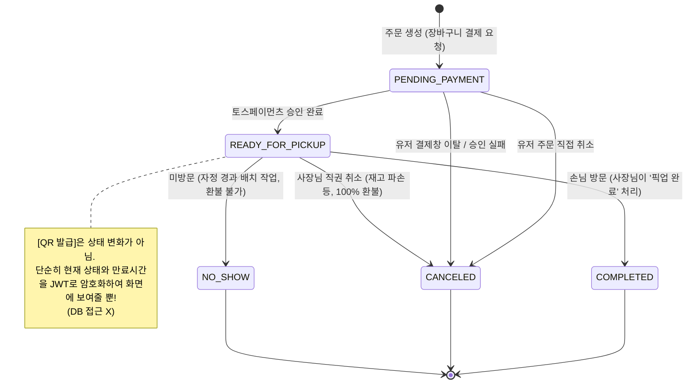
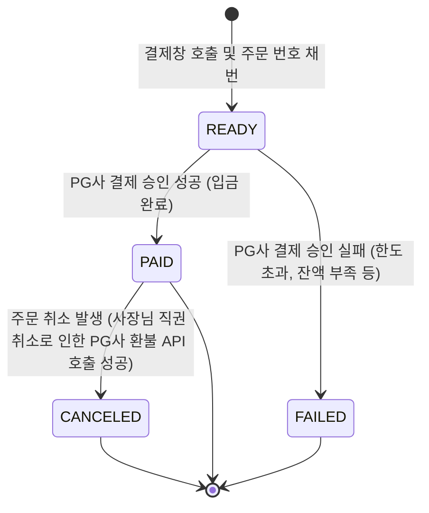
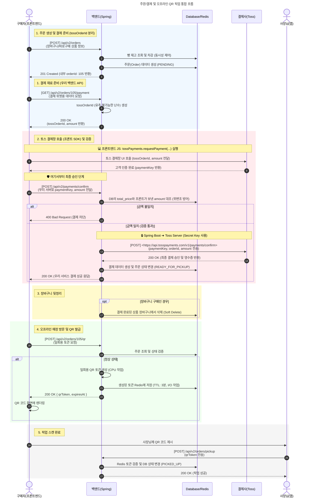
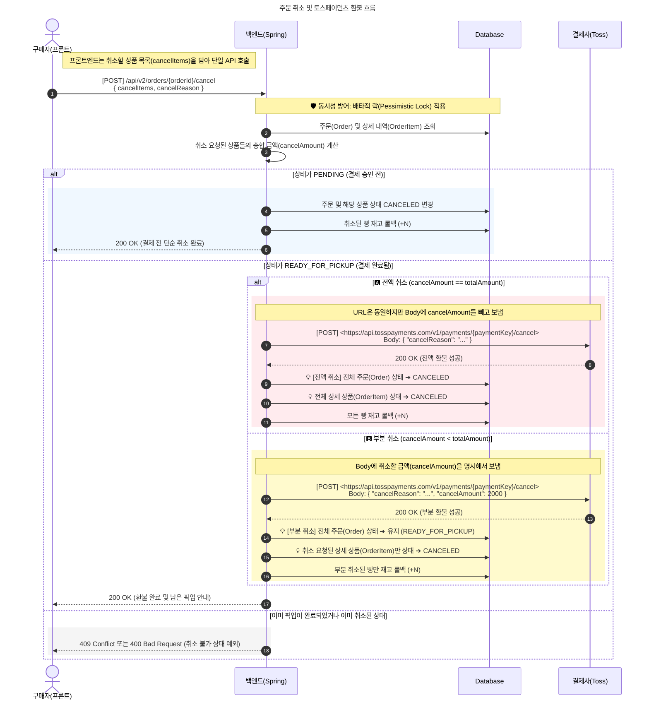
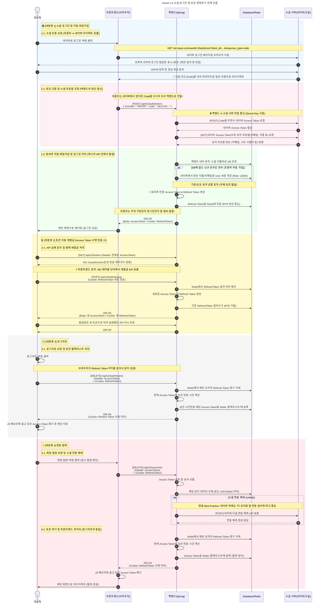
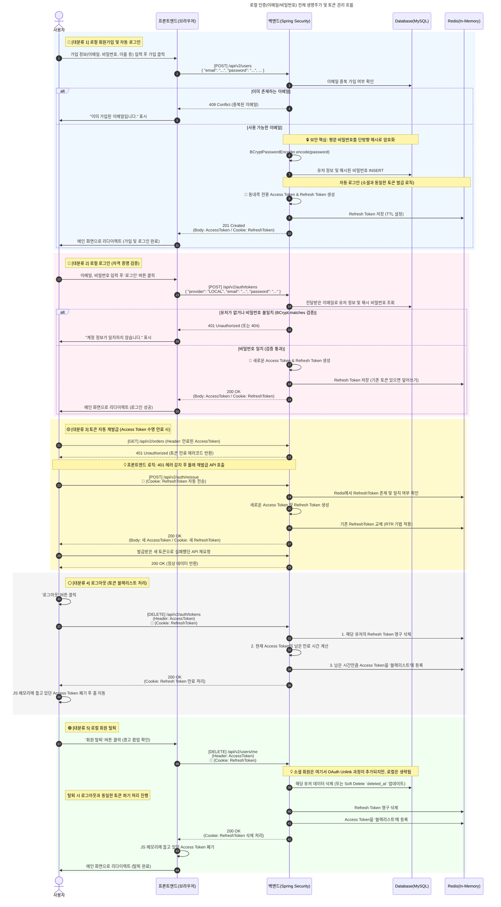

# timedeal-platform-docs
# 🛒 동네콕 (DongneKok) - 하이퍼로컬 타임딜 커머스 플랫폼
O2O 커머스 도메인의 실제 비즈니스 딜레마를 시스템적으로 해결하는 데 집중한 프로젝트입니다. PM의 시선으로 비즈니스를 분석하고, CTO의 기준으로 아키텍처를 최적화하며, 엔지니어의 코드로 리얼 월드의 문제를 해결했습니다.

> **💡 안내 사항 (Notice)**
> 핵심 비즈니스 로직이 담긴 **소스 코드는 비공개(Private)** 처리하였습니다. 대신 본 문서를 통해 프로젝트의 아키텍처 설계, 보안/인프라 구축 과정, 트러블슈팅 경험 및 협업 시스템(이슈 템플릿 등)을 상세히 공개합니다. 상세한 기술 블로그 기록도 함께 참고 부탁드립니다.

 

## 🎯 1. Project Overview
오프라인 베이커리의 재고 관리 비효율을 해결하기 위해 기획된 지역 기반 타임딜 플랫폼입니다. 
초기 팀 프로젝트로 시작하여 백엔드를 전담하였으며, 현재는 **1인 리팩토링**을 통해 기존 레거시 인프라를 전면 폐기하고 **Cloudflare Zero Trust와 AWS Serverless 기반의 클라우드 네이티브 아키텍처**로 고도화하였습니다.

* **개발 기간:** 2025.03 - 2025.11 (초기 모델) / 2026.01 - 현재 (인프라 및 아키텍처 고도화)
* **담당 역할:** Backend & Cloud Infrastructure

 

## 🏗️ 2. System Architecture

### 🌐 Domain & Routing Strategy
* **Frontend (`dongnekok.shop`):** AWS S3와 CloudFront를 연동하여 정적 자산의 글로벌 캐싱 성능을 확보하고 비용을 최적화했습니다. (Cloudflare DNS Only 적용)
* **Backend (`api.dongnekok.shop`):** Cloudflare Tunnel을 활용해 백엔드 서버의 공인 IP를 은닉하고, 단일 보안 터널을 통해서만 API 통신이 가능하도록 방어 표면을 구축했습니다. (Cloudflare Proxy 적용)

### 🗄️ Database Architecture (Logical ERD)

* **데이터 모델링 포인트:** 타임딜 커머스의 특성상 특정 시간대에 빈번하게 발생하는 '재고 조회 및 주문' 트랜잭션을 안정적으로 처리하기 위해 정규화를 진행하고, 로컬 상점과 사용자 간의 데이터 정합성을 보장하도록 관계형 데이터베이스 구조를 설계했습니다.

### [[🔗 벨로그 MerMaid 시리즈 ERD 설계 트러블 슈팅 기록](https://velog.io/@mgo0415/series/Project-ERD-%EB%8B%A4%EC%9D%B4%EC%96%B4%EA%B7%B8%EB%9E%A8)]

### 1️⃣ UX 편의성과 AI 데이터 무결성 충돌 해결: '판매권(Sale Offer)' 추상화 레이어 도입 [[🔗 묶음 상품 아키텍처 설계 기록](https://velog.io/@mgo0415/DB-%EC%95%84%ED%82%A4%ED%85%8D%EC%B2%98-%EC%82%AC%EC%9E%A5%EB%8B%98%EC%9D%98-%EA%B7%80%EC%B0%AE%EC%9D%8C-vs-AI-%EB%8D%B0%EC%9D%B4%ED%84%B0-%EB%AC%B4%EA%B2%B0%EC%84%B1-%EB%AC%B6%EC%9D%8C-%EC%83%81%ED%92%88-%EC%84%A4%EA%B3%84%EC%9D%98-%EB%94%9C%EB%A0%88%EB%A7%88%EC%99%80-%ED%95%B4%EA%B2%B0%EC%B1%85)]

문제: 사장님 편의를 위한 묶음 상품(랜덤박스) 판매 요구사항과, AI 생산량 예측을 위한 개별 상품 단위의 데이터 수집(원자성)이 정면 충돌. 기존 상품 테이블에 묶음 데이터를 혼합할 경우 마스터 데이터 오염 및 인덱스 용량 비대화, 검색 성능 저하(Garbage Data 98% 차지) 문제 식별.

해결: 이커머스 및 O2O 플랫폼 아키텍처를 분석하여 상품(Master)과 이벤트성 판매 단위(Offer)를 분리하는 sale_offer 및 sale_offer_item 다대다(N:M) 매핑 테이블 구조 도입.

성과: Product 테이블의 오염도를 0%로 방어하고 검색 성능을 광속으로 유지함과 동시에, 사장님에게는 '원터치 묶음 등록(UX)'을 제공하고 백엔드에서는 이를 개별 상품으로 역산하여 AI 학습용 순도 100%의 데이터를 확보.

### 2️⃣ 관심사 분리(SoC)를 통한 레거시 DB 리팩토링: 매직 넘버 제거 및 도메인 상태(Status) 3분할 [[🔗 Status 리팩토링 기록](https://velog.io/@mgo0415/DB%EB%A6%AC%ED%8C%A9%ED%86%A0%EB%A7%81-%EC%9D%B4%EA%B2%8C-%EC%99%9C-%EB%8F%8C%EC%95%84%EA%B0%80%EC%A7%80-%EB%A7%A4%EC%A7%81-%EB%84%98%EB%B2%84-%EC%A7%80%EC%98%A5%EC%97%90%EC%84%9C-%ED%83%88%EC%B6%9C%ED%95%98%EC%97%AC-%EC%83%81%ED%83%9CStatus-%EB%B6%84%EB%A6%AC%ED%95%98%EA%B8%B0)]

문제: 과거 레거시 설계에서 단일 status 숫자 컬럼(Magic Number) 하나로 배송 상태와 결제 수단을 혼재하여 관리. 이로 인해 데이터 확장성이 없고(OCP 위배), 휴먼 에러 시 데이터 전체가 오염될 수 있는 치명적 안티 패턴 발견.

해결: 상태 값의 책임을 상품(Product), 주문(Order), 결제(Payment) 3개의 독립적인 도메인으로 전면 분리. JPA @Enumerated(EnumType.STRING)을 적용하고 DB 타입을 VARCHAR로 변경하여 매직 넘버 의존성 완벽 제거.

성과: '결제 완료되었으나 픽업 취소됨'과 같은 복합적인 예외 상황에서 발생할 수 있는 데이터 모순(Contradiction)을 원천 차단하고, 새로운 결제 수단이 추가되어도 기존 주문 로직을 수정할 필요가 없는 안전하고 유연한 아키텍처 구축.

### 📊 도메인 상태 관리 설계 (State Management)

비즈니스 로직의 복잡도를 제어하기 위해 주문(Order)과 결제(Payment)의 상태를 분리하여 설계했습니다.
"과거에는 이 두 가지 흐름을 하나의 숫자형(TINYINT) 컬럼으로 관리하여 매직 넘버 지옥과 예외 처리 불가 문제를 겪었습니다. 이를 Order와 Payment 두 개의 도메인으로 분리하고 상태를 재정의하여, '노쇼 시 환불 불가' 같은 복잡한 비즈니스 정책을 안전하게 수용할 수 있는 아키텍처를 완성했습니다."

#### 1. 주문 상태 (Order Status)

#### 2. 결제 상태 (Payment Status)

## 📖 API Documentation & Specification
프론트엔드 협업 효율성 및 문서 신뢰성을 위해 **OpenAPI 3.0(Swagger/Redoc)** 기반의 자동화된 명세 시스템을 구축했습니다.

*   **API 명세서 (Redoc):** [https://maenggyuno.github.io/dongnekok-docs/](https://maenggyuno.github.io/timedeal-platform-docs/)
*   **설계 포인트:** 
    *   **전역 에러 체계 문서화:** `GlobalExceptionHandler`와 연동된 공통 에러 코드(ErrorCode)를 명시하여 프론트엔드 예외 처리 가이드 제공
    *   **협업 최적화:** 모든 API 응답에 대한 명확한 스키마(Schema)와 예시 데이터(Example)를 정의하여 커뮤니케이션 비용 최소화
    *   

---

### [시퀀스 다이어그램]

### 💳 주문/결제 및 오프라인 QR 픽업 통합 흐름

 
💳 주문 취소 및 토스페이먼츠 환불 흐름

 
🌐 OAuth 2.0 소셜 로그인 및 토큰 생명주기

 
🌐 로컬 인증(이메일/비밀번호) 전체 생명주기 및 토큰 관리 흐름

 

## 🛠️ 3. Tech Stack
| 분류 | 기술 스택 |
| --- | --- |
| **Backend** | Java 21, Spring Boot, Spring Security, Spring Data JPA |
| **Database** | MySQL 8.0, Redis |
| **Infra & DevOps:** | AWS (EC2, S3, CloudFront, EventBridge, Lambda), Cloudflare (DNS, Tunnel), Docker, GitHub Actions |
| **Frontend** | React, Axios |

 

## ✨ 4. Key Features
* **타임딜 핵심 로직:** 유통기한 임박 상품의 실시간 재고 관리 및 타임 세일 자동화
* **위치 기반 서비스:** 사용자 위치 기반의 하이퍼로컬 상점 큐레이션 및 지도 연동
* **보안 특화:** Cloudflare Zero Trust 기반의 인프라 보호 및 서버리스 무결성 검증 파이프라인
* **관리자 백오피스:** 상점주를 위한 직관적인 대시보드 및 주문 처리 시스템

## 🔥 5. Key Experience & Troubleshooting

### 1️⃣ 린 스타트업 기반 MVP 검증 및 비즈니스 문제 해결 [[🔗 MVP 검증 기록](https://velog.io/@mgo0415/%EB%8F%99%EB%84%A4%EC%BD%95-%ED%94%84%EB%A1%9C%EC%A0%9D%ED%8A%B8-%EC%BD%94%EB%94%A9%EB%B3%B4%EB%8B%A4-%EB%A8%BC%EC%A0%80-%EB%8F%99%EB%84%A4-%EB%B9%B5%EC%A7%91-%EC%82%AC%EC%9E%A5%EB%8B%98%EB%93%A4%EA%B3%BC-MOU%EB%A5%BC-%EB%A7%BA%EB%8B%A4-MVP-%EA%B3%A0%EA%B0%9D-%EA%B2%80%EC%A6%9D)]
* **문제:** 타임딜 커머스 특성상 특정 시간대 트래픽 집중이 예상되나, 실제 수요 검증 없이 오버엔지니어링될 위험 인지
* **해결:** 로컬 베이커리의 '당일 폐기 원가 손실'을 타겟으로 한 상생 MOU 의향서를 직접 작성해 현장 영업 및 파트너사 선제 확보
* **성과:** 실제 사용자의 Pain Point를 반영한 직관적 UI 설계 및 마감 시간 트래픽 방어를 위한 백엔드 아키텍처의 비즈니스적 당위성 확립

### 2️⃣ S3 투트랙(Two-Track) 아키텍처 및 Event-Driven 무결성 검증 [[🔗 아키텍처 설계 문서](https://velog.io/@mgo0415/Refactoring-%EC%A1%B8%EC%97%85%EC%9E%91%ED%92%88%EC%9D%98-%ED%95%9C%EA%B3%84%EB%A5%BC-%EB%84%98%EC%96%B4-S3-%EB%B9%84%EC%9A%A9-%ED%9A%A8%EC%9C%A8%ED%99%94%EC%99%80-%EB%B3%B4%EC%95%88-%EB%91%90-%EB%A7%88%EB%A6%AC-%ED%86%A0%EB%81%BC-%EC%9E%A1%EA%B8%B0-feat.-Tunnel-CDN)]
* **문제:** 단일 S3 Presigned URL 사용 시 썸네일 캐싱 불가로 인한 비용 낭비와, 클라이언트 직업로드 시 보안 위협 식별
* **해결:** 공개 이미지(CDN)와 민감 문서(Presigned URL)의 접근 방식을 분리하고, AWS Lambda와 EventBridge를 연동한 무결성(매직 넘버, 크기) 검사 로직 구현
* **성과:** 백엔드 I/O 부하 0% 유지 및 불필요한 스토리지 비용/런타임 보안 위협 방어

### 3️⃣ Zero Trust 인프라 및 백오피스 논리적 망 분리 [[🔗 인프라 구축기](https://velog.io/@mgo0415/Refactoring-%EC%8B%A0%EC%9E%85%EC%9D%98-%EC%8B%9C%EC%84%A0-%EB%B0%B1%EC%98%A4%ED%94%BC%EC%8A%A4Admin-%EA%B5%AC%EC%B6%95%EA%B3%BC-Zero-Trust-%EB%B3%B4%EC%95%88-%EC%95%84%ED%82%A4%ED%85%8D%EC%B2%98-%EC%84%A4%EA%B3%84%EC%9D%98-%EC%97%AC%EC%A0%95)]
* **문제:** Admin 페이지 구축 시, 서버 IP 노출로 인한 DDoS 및 포트 스캐닝 위협 차단 필요
* **해결:** AWS EC2 인바운드 포트를 전면 차단하고 Cloudflare Tunnel을 도입해 공격 표면(Attack Surface) 원천 제거, OTP 인증 정책 적용
* **성과:** 사내 VPN 구축 비용 없이 논리적 망 분리 효과 달성 및 고정 IP 유지 비용 절감

### 4️⃣ 우아한 기능 저하(Graceful Degradation)를 통한 무중단 UX 제공 [[🔗 트러블슈팅 기록](https://velog.io/@mgo0415/Troubleshooting-AWS-%EB%B9%84%EC%9A%A9-0%EC%9B%90-%ED%94%84%EB%A1%9C%EC%A0%9D%ED%8A%B8-%EC%84%9C%EB%B2%84%EA%B0%80-%EA%BA%BC%EC%A0%B8%EB%8F%84-%EA%B3%A0%EC%9E%A5-%EB%82%9C-%EC%82%AC%EC%9D%B4%ED%8A%B8%EC%B2%98%EB%9F%BC-%EB%B3%B4%EC%9D%B4%EC%A7%80-%EC%95%8A%EA%B2%8C-%ED%95%98%EA%B8%B0)]
* **문제:** 클라우드 비용 절감을 위한 서버 중단 시, 백엔드 다운으로 인해 프론트엔드 UI가 깨지고 502/CORS 에러 노출
* **해결:** 앱 초기화 시 경량 `HEAD` 요청으로 서버 헬스체크를 수행하는 HOC(MaintenanceGuard) 패턴 구현 및 Spring Security 403/CORS 에러 오버라이딩 해결
* **성과:** 추가 인프라 비용 없이 서버 OFF 상태에서도 안정적인 '점검 중' 화면 제공

### 5️⃣ 리버스 프록시(Nginx) 라우팅 충돌 해결 및 OAuth2 커스터마이징 [[🔗 트러블슈팅 기록](https://velog.io/@mgo0415/%ED%8A%B8%EB%9F%AC%EB%B8%94%EC%8A%88%ED%8C%85-Cloudflare-Tunnel-Docker-Nginx-Spring-Boot-OAuth2-404-%EC%97%90%EB%9F%AC-%ED%95%B4%EA%B2%B0%EA%B8%B0)]
* **문제:** Nginx 리버스 프록시 환경에서 소셜 로그인 리다이렉트 시 404 에러 연쇄 발생
* **해결:** Spring Security의 기본 엔드포인트를 Nginx Prefix(`/api`) 라우팅 규칙에 맞게 동적으로 오버라이딩 처리
* **성과:** 프론트엔드-프록시-백엔드 통신 흐름을 단일화하여 안정적인 API 네트워크 통신망 구축

 

## 🤝 6. Collaboration & Team Workspace

단순한 코드 공유를 넘어, 실제 비즈니스 환경과 동일한 협업 파이프라인을 구축하여 프로젝트를 운영했습니다.

* **Issue Template & PR Convention:** 기능 추가, 버그 수정 등 목적에 맞는 템플릿을 고도화하여 리뷰어의 맥락 파악 시간을 단축했습니다.
* ### 📌 체계적인 이슈 추적 및 문서화 (Issue Tracker & Convention)

  
  

* **커밋/이슈 컨벤션:** `[FEAT]`, `[Refactor]`, `[Infra]` 등 직관적인 말머리와 라벨링을 통해 작업의 성격을 명확히 분리하고 추적성을 높였습니다.
* **상세 템플릿:** 단순한 버그 수정이나 기능 추가를 넘어, '배경/목적 - 기술 스펙 - 체크리스트'로 이어지는 상세 템플릿을 사용하여 작업 전 설계의 타당성을 검증했습니다.

### 🤝 7. Collaboration & Workspace (문서화 및 에셋 관리)
단순한 코드 공유를 넘어, 실제 스타트업 환경과 동일한 수준의 체계적인 문서화 및 자산 관리 파이프라인을 구축했습니다.

  
  

* **Notion 기반 사내 위키:** 기술(Architecture, ERD, API) 문서뿐만 아니라 기획, 영업(상생 협력 의향서) 등 목적별로 문서를 카테고리화하여 중앙 집중식으로 관리합니다.
* **Google Drive 자산 동기화:** 아키텍처 원본 파일(.drawio), 데이터베이스 산출물 등을 기술 개발 전용 폴더 체계(01_Architecture ~ 04_Infra)로 세분화하여 안전하게 보관 및 링크 연동하고 있습니다.
* **추후 고도화 계획 (To-be):** Jira 티켓 기반의 스프린트 관리 및 Slack 연동을 통한 CI/CD 배포 자동화 알림 파이프라인 구축 (진행 예정)

