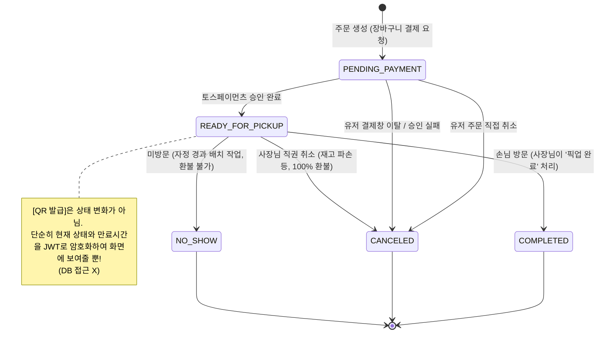
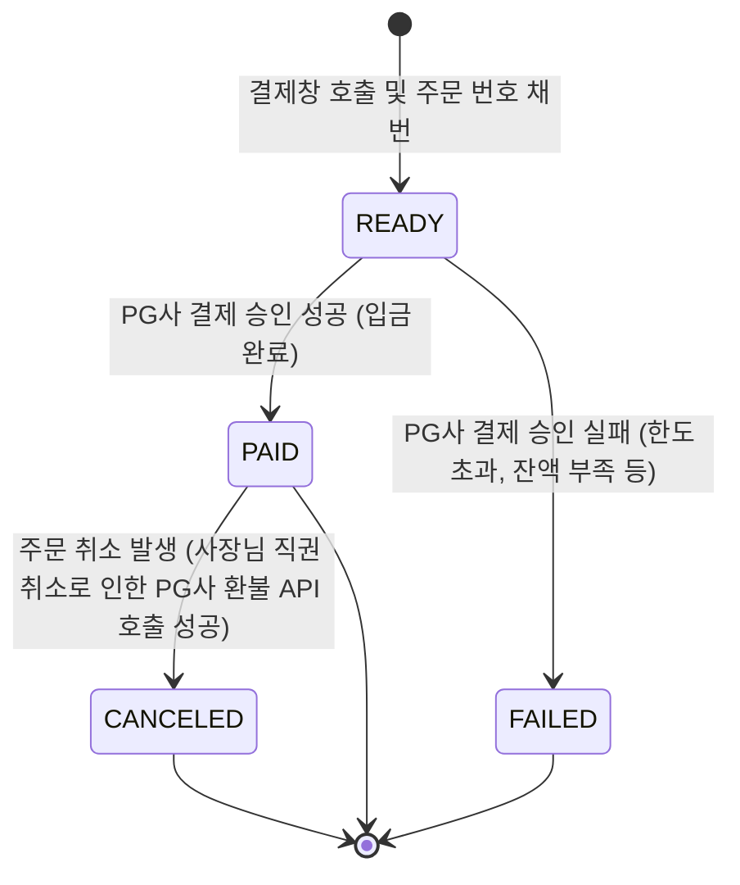

# timedeal-platform-docs
# 🛒 동네콕 (DongneKok) - 하이퍼로컬 타임딜 커머스 플랫폼
O2O 커머스 도메인의 실제 비즈니스 딜레마를 시스템적으로 해결하는 데 집중한 프로젝트입니다. PM의 시선으로 비즈니스를 분석하고, CTO의 기준으로 아키텍처를 최적화하며, 엔지니어의 코드로 리얼 월드의 문제를 해결했습니다.

> **💡 안내 사항 (Notice)**
> 핵심 비즈니스 로직이 담긴 **소스 코드는 비공개(Private)** 처리하였습니다. 대신 본 문서를 통해 프로젝트의 아키텍처 설계, 보안/인프라 구축 과정, 트러블슈팅 경험 및 협업 시스템(이슈 템플릿 등)을 상세히 공개합니다. 상세한 기술 블로그 기록도 함께 참고 부탁드립니다.

 

## 🎯 1. Project Overview
오프라인 베이커리의 재고 관리 비효율을 해결하기 위해 기획된 지역 기반 타임딜 플랫폼입니다. 
초기 팀 프로젝트로 시작하여 백엔드를 전담하였으며, 현재는 **1인 리팩토링**을 통해 기존 레거시 인프라를 전면 폐기하고 **Cloudflare Zero Trust와 AWS Serverless 기반의 클라우드 네이티브 아키텍처**로 고도화하였습니다.

* **개발 기간:** 2025.03 - 2025.11 (초기 모델) / 2026.01 - 현재 (인프라 및 아키텍처 고도화)
* **담당 역할:** Backend & Cloud Infrastructure

 

## 🏗️ 2. System Architecture

### 🌐 Domain & Routing Strategy
* **Frontend (`dongnekok.shop`):** AWS S3와 CloudFront를 연동하여 정적 자산의 글로벌 캐싱 성능을 확보하고 비용을 최적화했습니다. (Cloudflare DNS Only 적용)
* **Backend (`api.dongnekok.shop`):** Cloudflare Tunnel을 활용해 백엔드 서버의 공인 IP를 은닉하고, 단일 보안 터널을 통해서만 API 통신이 가능하도록 방어 표면을 구축했습니다. (Cloudflare Proxy 적용)

### 🗄️ Database Architecture (Logical ERD)

* **데이터 모델링 포인트:** 타임딜 커머스의 특성상 특정 시간대에 빈번하게 발생하는 '재고 조회 및 주문' 트랜잭션을 안정적으로 처리하기 위해 정규화를 진행하고, 로컬 상점과 사용자 간의 데이터 정합성을 보장하도록 관계형 데이터베이스 구조를 설계했습니다.

### [[🔗 벨로그 인어남 시리즈 ERD 설계 트러블 슈팅 기록](https://velog.io/@mgo0415/series/Project-ERD-%EB%8B%A4%EC%9D%B4%EC%96%B4%EA%B7%B8%EB%9E%A8)]

### 1️⃣ UX 편의성과 AI 데이터 무결성 충돌 해결: '판매권(Sale Offer)' 추상화 레이어 도입 [[🔗 묶음 상품 아키텍처 설계 기록](https://velog.io/@mgo0415/DB-%EC%95%84%ED%82%A4%ED%85%8D%EC%B2%98-%EC%82%AC%EC%9E%A5%EB%8B%98%EC%9D%98-%EA%B7%80%EC%B0%AE%EC%9D%8C-vs-AI-%EB%8D%B0%EC%9D%B4%ED%84%B0-%EB%AC%B4%EA%B2%B0%EC%84%B1-%EB%AC%B6%EC%9D%8C-%EC%83%81%ED%92%88-%EC%84%A4%EA%B3%84%EC%9D%98-%EB%94%9C%EB%A0%88%EB%A7%88%EC%99%80-%ED%95%B4%EA%B2%B0%EC%B1%85)]

문제: 사장님 편의를 위한 묶음 상품(랜덤박스) 판매 요구사항과, AI 생산량 예측을 위한 개별 상품 단위의 데이터 수집(원자성)이 정면 충돌. 기존 상품 테이블에 묶음 데이터를 혼합할 경우 마스터 데이터 오염 및 인덱스 용량 비대화, 검색 성능 저하(Garbage Data 98% 차지) 문제 식별.

해결: 이커머스 및 O2O 플랫폼 아키텍처를 분석하여 상품(Master)과 이벤트성 판매 단위(Offer)를 분리하는 sale_offer 및 sale_offer_item 다대다(N:M) 매핑 테이블 구조 도입.

성과: Product 테이블의 오염도를 0%로 방어하고 검색 성능을 광속으로 유지함과 동시에, 사장님에게는 '원터치 묶음 등록(UX)'을 제공하고 백엔드에서는 이를 개별 상품으로 역산하여 AI 학습용 순도 100%의 데이터를 확보.

### 2️⃣ 관심사 분리(SoC)를 통한 레거시 DB 리팩토링: 매직 넘버 제거 및 도메인 상태(Status) 3분할 [[🔗 Status 리팩토링 기록](https://velog.io/@mgo0415/DB%EB%A6%AC%ED%8C%A9%ED%86%A0%EB%A7%81-%EC%9D%B4%EA%B2%8C-%EC%99%9C-%EB%8F%8C%EC%95%84%EA%B0%80%EC%A7%80-%EB%A7%A4%EC%A7%81-%EB%84%98%EB%B2%84-%EC%A7%80%EC%98%A5%EC%97%90%EC%84%9C-%ED%83%88%EC%B6%9C%ED%95%98%EC%97%AC-%EC%83%81%ED%83%9CStatus-%EB%B6%84%EB%A6%AC%ED%95%98%EA%B8%B0)]

문제: 과거 레거시 설계에서 단일 status 숫자 컬럼(Magic Number) 하나로 배송 상태와 결제 수단을 혼재하여 관리. 이로 인해 데이터 확장성이 없고(OCP 위배), 휴먼 에러 시 데이터 전체가 오염될 수 있는 치명적 안티 패턴 발견.

해결: 상태 값의 책임을 상품(Product), 주문(Order), 결제(Payment) 3개의 독립적인 도메인으로 전면 분리. JPA @Enumerated(EnumType.STRING)을 적용하고 DB 타입을 VARCHAR로 변경하여 매직 넘버 의존성 완벽 제거.

성과: '결제 완료되었으나 픽업 취소됨'과 같은 복합적인 예외 상황에서 발생할 수 있는 데이터 모순(Contradiction)을 원천 차단하고, 새로운 결제 수단이 추가되어도 기존 주문 로직을 수정할 필요가 없는 안전하고 유연한 아키텍처 구축.

### 📊 도메인 상태 관리 설계 (State Management)

비즈니스 로직의 복잡도를 제어하기 위해 주문(Order)과 결제(Payment)의 상태를 분리하여 설계했습니다.
"과거에는 이 두 가지 흐름을 하나의 숫자형(TINYINT) 컬럼으로 관리하여 매직 넘버 지옥과 예외 처리 불가 문제를 겪었습니다. 이를 Order와 Payment 두 개의 도메인으로 분리하고 상태를 재정의하여, '노쇼 시 환불 불가' 같은 복잡한 비즈니스 정책을 안전하게 수용할 수 있는 아키텍처를 완성했습니다."

#### 1. 주문 상태 (Order Status)

#### 2. 결제 상태 (Payment Status)

## 📖 API Documentation & Specification
프론트엔드 협업 효율성 및 문서 신뢰성을 위해 **OpenAPI 3.0(Swagger/Redoc)** 기반의 자동화된 명세 시스템을 구축했습니다.

*   **API 명세서 (Redoc):** [https://maenggyuno.github.io/dongnekok-docs/](https://maenggyuno.github.io/timedeal-platform-docs/)
*   **설계 포인트:** 
    *   **전역 에러 체계 문서화:** `GlobalExceptionHandler`와 연동된 공통 에러 코드(ErrorCode)를 명시하여 프론트엔드 예외 처리 가이드 제공
    *   **협업 최적화:** 모든 API 응답에 대한 명확한 스키마(Schema)와 예시 데이터(Example)를 정의하여 커뮤니케이션 비용 최소화
    *   

---

[](https://viewer.diagrams.net/?tags=%7B%7D&lightbox=1&highlight=0000ff&edit=_blank&layers=1&nav=1&title=%EC%8B%9C%ED%80%80%EC%8A%A4%20%EB%8B%A4%EC%9D%B4%EC%96%B4%EA%B7%B8%EB%9E%A8.drawio.svg&dark=0#R%3Cmxfile%3E%3Cdiagram%20id%3D%229PS7ncHvAENYPygWgop7%22%20name%3D%22%ED%8E%98%EC%9D%B4%EC%A7%80-2%22%3E7H1Zc%2BJI1uivcUTPw0wIAV4eWWRbFBKFAWN4%2BQIELbO7jDBIv%2F6eLRcweKnqqpqpuBFd7UMqlcvJs59U5lm%2BstjdPA%2BeHoPVaDw%2Fc53R7ixfPXPd4nkuB3%2BwJOUSt6hK4ufJiMscU9CaZGMuzKnSzWQ0XksZFyWr1TyZPO0XRqvlchwle2WD5%2BfVdr%2Fa36v5aK%2FgaRCP94aBBa1oMB%2B%2FqtadjJJHmcaVVX47nsSP0nMhl%2BcHi4GqK%2B2uHwej1dYqyntn%2BcrzapUwtNhVxnNE3j5ark881f0%2Fj5fJkRc66%2FFzYzhFlLjOfDCEdaFKMrrx82IwGVUHyUCKL8pn7vmZmwe85wF06L%2FzbxscXnmE9fSvs3xp7%2Bm%2F%2F%2F3vs2JlmUwSRBo98ypnpfxZuXLmlc9KlbPyJY7LK52V3bMyP3XOripUs4wll9fy1tXlWalw5lXPrgpnlwV8elWldioEQDtO847qUpVylZ5cnF0WpfDy%2FKxcpKfFs9KVqgn%2FUVelc2wVBitjxn%2Fr8bfNeBmNq5NB%2FDxYYNFgk6yWm8Vw%2FEy%2FomT1DC0hSpGq1tRqCfsp8QwvaNAwEA%2F6%2BWtv%2BKUczhUHVsLh82iveGZ5wMG%2FsAdYxWQSTZ4GS1ytsmd6IeyUc6%2Ff%2B6v19DxZxkder5bV67i8w8F6DMi%2FG48m69d1v97sTWh%2FdQC4dGGKf7VX6%2FW%2FbEy0gBZtXEhFQUGpiKO8hIFe%2FkVFRZjBvxS6n5kkn%2BPhX24BqAipwC1cClAsckUhQPxvuUrG%2BAIxmeus%2FlZLQaSW%2B88JeuNh5XHtESggFg%2Fp7ShBVnAxL7nmFb7oOn8lgIHG82j87I9UI%2Bdqgc%2Bhx1eDxgH%2BG1gkJoaRv7CwzB7F8tdGq31WrFLl68HTBP7%2Fgsy7wk7WzF5zfGf4bFpx%2FtrDMAwcCcIiRMD5JbOafkoUiIv5il41hi5zRLEuvauRwV0AUguvJlf2Xk2tqqQCY61cVPzsUZ8lbKnkqOZzhHTos3R2eUwKAFy6pLccZFyaeBkfX13RmMuKPPWqWjR7df7pMR9Sz1%2B01v%2BSkV1WhUZQApFwwn6dsxMk9tdXL6z64c2xIbwagyFkIGX4f%2BV5PEjGIz1ll3pkcsM2VkKETPtO0SAPJCdi9AqA72OhE8wgK1hGFF2e5hCqSgumeOJt%2BQVPS1%2F9T%2FPNjfcm21wTSq6fBuliTALuFBudmiwtIxeWrmVOokbeIwSoeUXvQsul6kcIUM1rX7r8JQMpMSucY6tG5ii2YPSDUikpbaf1KRCNsMclEcNROv0kbWKdxpeTCN2bAY5jsFhteAGOU%2Bd4OTqmEIpF0QN5DXyWmt3%2FnGlLgFGISCqcVHFIn1V5BUbJOhqxXuG1OK3LQQ9Wv%2FzLzNFWKpfcyTni%2FPjwVy9jY1RgX6CLmcqvYWjXKI%2FLZTWuj1oTUL%2FWMkT1lflg%2FZ9ntHHWifz%2B6z%2F%2F%2BY8mi7IyuIC4rj7Ejnqgn0dyxz%2BJ6bdIiFpiDOB4X6vbrzdvka%2FRP6JSqoplqzIKXigpvFLIFoH3l4iTL%2BP0DXH7wVXWskxWmdbUu8ZxGCP4QinNS0EkDOiqYvTAgeQpFwXNJVcZwrQg5SvbblbYuxR0sCH8GeF7ymgR%2FKD8BTfs78nz4g3Je1RN2DN0Da0TZdjY%2FyxdvKH14S8j5%2BqSuCUZzP8PTOporGjAeY%2F5lBwWmsiLqkadfXkoAoGQLi3bx0h5bhqXY%2B%2BxUFnp6sCiOZjfYJ4o%2Br4k3UDWdklbuueqUDlRZSTYw1Y%2BrggKpAjKA9RTdyxT3tSnYsgJ4b1anvEcnZNT4381bNOTLV61IEK%2Fjyi7%2FJoQTrMmelvHxG8BJTCIeHKzsB566tiXS24eyjr0i7DK%2BJmb%2Bqs1jp7HWEuJCtsxQkPizXEdIVY9qH3mY856TBIMgpTQ4Cd%2B%2FA%2FKUMWM%2F4lWC2TQ3AkG1Tx5nFEPuU4ZnidZsEK6IPfmDI%2BJaSVfLBvjrxNC7QSRHZV0B0GFy5w2iPYp513b%2BYPi5GR045Pew%2BHYT7m17LRd5q0wCssQHgZO7q87r1Tt%2Fd914%2B7%2FvvqVL52v783tYxbgR2T4lSKJ01aBfgW9A2Zb7TTCWuREapRfBwTEdnzPhCyq4ILz2ZhCXsUU3ne1CQdoql3s%2Bc2MlYNOV0%2FJZ9o9GmDSFK6WWa%2FFP0q2r6wgnKW9bMeiBu%2FOSsxVi1aMjKzaA%2FirtfqbQlnj%2BTgZf5IAdFBJU0LB%2BSQBFDQBvB%2BOPAwAliyfHNW3zbmGtSWIybhStt4H7e9PhJHEH%2F72fFLOW2pWxWP2vF5t4ldxxX%2FA2T0dbVGF70WFjki9o77WCRtJs6dq6Wirn2MjvRRvYlFHrI%2Bi8nUAqfK1Y1jqSgVPLl%2BLsU%2Bg%2FKCXPX4%2BMjCOF2uGNZrescn8r3a7LiLTxESJ58DPu2581yQ%2BGIbAfIXz7bm9mo2X3OV49zR5Hq9LtNoXr9zud9nK9CPrVUH5uu9cKzOBJeMVKXQbR2XCUUX0vlS7QKx%2BToRpyWWAT4qwogqDHMmSKL2MMyyp8NIrkf8RUSSJAENlx9MAxKhlNuHfQq6deSgf4Ubu7ocE4tMkmm2eTopDTVEfMW3fYDnmn5Ncf9SJMdKuWj4t8o4ZemjeedX%2FO2LhHWMoe9H27bpT1LJnpOn4nUkIIo2eTB6SxxEfpg%2BXG0xnmpcuODmp85v5q9XqBlbi%2Fzr58%2BbD5d%2BbZjL796XOm%2Bp8qJ0AlZzoOklV9nb9OHhCcLKgNG95uapLKjQHv8BrSybRYF6aT%2BIllCWrJyiluqX1E2eTc6oEYEqD5kv8071ev8CsyrsFDKPy9TZ0%2B2n5qV91Jn33Puw%2F1JJedz5r5%2B%2Bd6Pbeqbe9fJhFhaAaFBvVXj6cehP%2FdvTUv71bfW35u6BamvuTcmHY3W2izJkMbu%2BcqLp6qedH%2BVFazAdp8SVaRC%2FBtLQNKlfZaBHB%2B6Ez7u7mX1vQ10OcjNz5bHQTn%2FtVzw2mnU34UC40Uj8eLebzkVN7GcPY6u1oV5924nq7s9X1WqU0zOIt9J8OXWpvGS2ut4Ob%2BTRKc7OhG%2BaG3fvNqFK2YD%2FuPdSeeq0cvdO%2Fuc96%2BdpTdHv3NHQLV%2F4ynEcP9%2FPhIpz708JltLifwvsFmKvbgHfHbWcSTIM0mPhxfzFfD2Fs0WI0%2BVL1nbC1jYNpM1evwLiqnScYV37QvXMGUCdoB3l8Z3Bz%2F9R3Hx1oLwva%2FsS%2FCde9hzCDsaf9buhgn%2FV8bd7LN2GNvt4SFDMGfMQAYG925U9hVaoA3%2FSfhjdbGHVt2ZvE0Gtp7Vf9nIxk%2B6UFWGTs4jvboOoB1vZGkQun0SdG0Wg31QhyYfvICNodGkFQwRGUcvsjiAvhPg52jWrpE72HVdV7r4DzOFgBmXdAKxBk8cEKAMYre70Xwumnep%2FG0nuUg5YXg%2B5uTW%2B5%2FgqxzeseywrMbD4pBlVc68f5oDtajaitEtLtdHhznSHfMJ352GPlisbxdbpbfp1uX%2FpZ4RL%2FWZS4C9odB94uApyGU4JlNP60372e97r3j1CWjW5rLwO3c%2BVPAjec9vY4N2yXDkaEq1l8HHah%2Frx8i1yFsw6AE6MlzjqwcfXYy9%2B9RJOy%2FM1Nhvk7ZwhyEMdMY60WLkc39wU95qlfNGOOXaLlm7uXYXe%2B6XWLTr1be4zc%2B%2FWgW0ROhnkUHeDmNbzzOLyZL4eL3Hy4bCa9xXXW7%2B6ehgsYJ3DpcHmX9rrbd8YW21LH6T88Qn%2FXm577%2BBJNVzGMYda%2F2c0baXkxBAe8%2FhA%2BjRcdkkjRbXwBVP6CfY9cpp3GpOSA5LtAWhndhttet0AUAjSWNpAuiUpKk6%2Bbb%2Bm6kcbLRlp5rjx2hiBLv7S3L%2FIOrzaN5sRKFxqa4n03RN5T%2FDYJaZX7XY9mFi2unvsgm%2Fys5yKPWVyfO6B6FzlnuLhOsP6dB3R5W8O%2BMlrxNq94z909RvkAMHw9Hd1cpf4N%2F4VVgtHDqrUOaJVm4d9ij7Mc4oAlJfDppIDcAhI4B2t2DRI4N4F1msOabnAEPRek8m3tcYiSGda17xaT%2Ftv0oLmmB30P8%2Fge%2FQXauCow3c%2FX2DbTX%2B4RpPkKnp%2F7N7mn%2Fs0dPFuD7LjCsWSDh6c5rOcuXKLWUes%2FEr5YxSBTt6CNSBbcZdHN9caepV7p2d3j6OaaZlbP1UCvzDNc2ygP1EsS5W4%2Bvm0yzpbM2zuWN9RaQPJMcJYLK0a2%2BS6uMvA0PI%2Fyd6C1kjnyOfCzuy%2FfOihRVv3ufDm4baKMRLwDb%2BUQf5U7fH8ZMx%2Ff1oqy4m%2Fh0oEVTw7lIc1DpHFv%2B6dztMxxRitD8vn8orK7qI0758VG9OU63EYLoON0hitM1IGcTHQH8q%2FuRoizm2h%2F3Qkj%2Fs18pmcGFgVaUQH20m6mzD8easwtlU%2Ftct%2BSBocYynHbVX%2BLXK%2FoBehZyf1tfXq%2FHVf2aanRnhUtWmnDaqz7Dz7JcubTg7nc0GrFg25TS4ggQ0kU72xZj%2FMhvXIbp3vlU0Pnh5KmzpSA1sPW0mGJkWglshAP9FsR5rCvv5BuXWqLx82jXdZehvlmgqPd50BvF2rbpvSPy9mOF31Ozj7Aah7aA5aM9dJgOpPRBumfyHk%2Frkvfp9iSothi2CZs7tS6jau%2Bpcl%2BOsd50DLPgNcM5ITIB3jjCrywYHvgjViWwT9PrZ%2B2Ct6hVssiyHzyQPqgWWCmj29T4TVgY7Rhv%2B0Nq%2BENW0XwXhzeQNtL0l3g3xanA3jemJRhDHczeKapMnLn5%2F32Kg7a%2Fe24qq2EvGhVoOImeFFrlB2s2ye0Gkw%2FN3eoC2Glil7v4e6R5tW6avW7d09R9kOUSrxOlOqQz%2FKKUptuUPkllIp2xJuUChJ%2Bn1KzRrXz0yi1Oev8o5Sq8PjHUirTj6bUi%2Bd1%2FXY9L7afZ8XtqpMvpzDX5Q%2FKVfKTiVrzxyyZMCNZm1re66EVmhD2WuDFY3xA0UcrZ6zdSiEH2uSAdmbFhkUb97AK0YFc5RkInuGJ747m7e59OuxeP%2FW9q9zotpwbVZxdmEX5RrWUNdqxG2a93dhlrPehbfC0i41JDfq9n4y64ar%2F0IyHD8GkftufR4s78Da8NcWYutt15F5vojSX9eF3f5rsaUReuYQ898YkgNUq4b%2BLvzvl5%2F7DfBHhPB6CGOTHEuYO7c4TkCsYp0r6S6Co7v1FH%2B2Zh0RbSX3AI1DMor8M5%2BC9bBv53FXzJpmPu%2F0UOThKyzOgztUYJMI4r%2FFKZUO3vwCrwWlMYQwPzvSD8cC4vrif9aFvoNYnwKMz6F5tYI7rYX50oaVM9w4sksfHCMY9bq%2BK9WrncdDNbYf5moMWS%2BPkWGaAk8Se%2BznNsVLKBbdBTHTSvQZOgr9giQ8e7uZWW7TqPfd62wA8jbrFWSP%2Fg%2FPq9oGD737mvNJfMK8U2gGpM58CPV6wp7mahu0O8C5YXd%2FT1gNKrLsjbSn%2B%2FO72aQ1GN49PPTfZ9EGj1bsYUwZ%2BuE0OvYPzAGPHP9r%2Bw91q0A2fLf4QubPKSENWk6uPyg2%2FUpz3b0agZcuPI%2FCdo0UBJDdKo5M0tP1x%2FMw3o8U8G3Rr4MUdwZGSOYviC8jui79b4bLfAdkAOIVxfR093G1HD%2BAjtaM8xteDbFYIp5EbtEobkUVboFnQCbWNjH3evz2UQddAF9fFxjT40fYx3vRG%2B%2F6n2of1SgfufQryHO2Qc7I3prpt9fsz6wv8WwN57W96%2BdoL9KjXtcFR10%2BMDzzaxehCNPkC5PXT8HZ2DtYAWCq1HHhYc7Cpkij11yPgO8DDptcCi2IxB%2Btil4G8AdoFnbeYLxrunpXA0a1P0FV0m%2BC8loNuAenlM%2Fhga3NpcDq4DddfKDNRmtcrpUKQdp4aCv%2Fu%2Fbzf%2FkT7HH%2FaiJ2w6OebF2ypGDkWZEFm5M7TBmTc%2FHM8ZUci7s16Lh6zYSXGOP%2B21trGjWow%2F%2FKZsVdAjyyK82h2nfbyR%2FiyVcgd6gtYg7T3MDsfAk18Ck9AlygLel2oT5Zo%2BeLQ4m9MvU3YPsFXIhssWgasfo6XwT7JwP6B%2BmQj7o7IU8xonZKDab3q%2F0j%2FU8Qd2CAr0KMz%2Fxbk783jCRpRvz9BI1aesL28B8%2FAyJSR%2B%2Fg0uvmUXIX%2F3%2B9G4D2Qt9DNTWAMB2P9%2BNjAQ0oxOgI%2B02O%2FUkZZujLyDluz5R39%2Fi66usco5622X2l9DK98XreADzAB76oyzD%2B%2Bx3PSZzjvd7%2Brjw5FrSrf915tMQK7jqO9p%2FD6Hfy6Bv95SzitbD8hq3Yvw3z5p4%2BLZMgxW4L0ynGZFUy2lv33tIrc7YrywhXMEcdZrTUTGj%2F%2B7FPrukAf1aZr8AU1nXxWD0t796Rr1p%2FA1WaYv2O%2BqPSXo2rCnvdS0%2Buiv%2Bj9EI%2Bg3hs89EGWzV%2BG07KWEf3p3SK86Tl79va0535e781d8Ud2mobcnkPtV3%2FITkK74Gm0YD8qsHCC4%2B5Pmz9gN5XEHqg1gRdykYfRbdDbN1fZQHyrXreWDd1d7pNy%2BVi7TbA15uB7gI8XPvE6PD32luHLEPDaP5BNmJGsI0%2BgHZutttFtHDduywWJhscBwre1ZW%2FhIf1v62AnBZVCKjIOaNo%2F7wPOI8xU3lzPhvloFeTxfYzUlVJsg3c%2FlIB3Slu%2Fcgl%2FC86XT%2FKPjrt0rzf%2BzYfsnu%2BWwft9hU%2FRIlz3Wx%2BXecN9WfQR%2B%2FKE3Po4bzQob3R3UW%2FlElW%2F3v1HYkJXX3FfFGWsOf%2Bv4mvg9SwDyrmGxWEX%2Bq%2FwPq2ee5XgODFDZ%2B3oSMP9OCn%2BprfR8oljikEuwwVQc%2FK1VQP%2BvQasxxvaqXLTvPJnTupXa27QDlfBtOwCFrJBxUmD2ydYRaDU9vUKytzRxCkOgHpH0%2Fn5sOXskFqDaRyHi%2B0mrPbgvetVkBZywfRuXZ82wRYp7aAdB%2BBcmMe2mptg6gMFh9Ce7wyrfhIu4rQ%2B9bbhzTYBKzgL0hJYh14B3xmCNKlP%2FWKYOlDmb4JqlME7cbh8SurtDrRXxnE5MK48vOOMpqNzzlnTvDn6l43Bphq6W%2F4163f72dfpTv1VTyWKaTL5al9N%2FaGWo7js4t7td4sv%2FRuOrw8eSkm0vKe9Bv2HPliD0PZnsb4LJoU0bMcws9JuWEG4hzBgDPcRFbZBtQMY62T1aWnboOfeBndyBdNmEcr4%2FWqEZTl4xwkn8A62MW2m%2BLzRwuf4DmBvGuA7KaxQGmTYj4%2F9AMbhnWmEz3f4vEGrOoPn%2BBtoCceR4fs%2BjiML8Tn2g21MvTyW0Tu4ulVcYQ%2FbcWA106CKc2vCe%2F4W2wlpPiV6DmPdNWjuTVhtrwjtYh0ow%2FF2oI5XCGFsYTvYABVi3zmos2tgPZxjO8pRWVoAnYPU0YH5eS49h7bDKbxX7WE7LtRzA6zX7mAZzBvxVXIRX2GG4w6w%2FTzhIsP3cM8hzXUbUhnW6RWpDOcxxXEH3AY9p3Zd85zapH6xDcZ3L6XnExqfKsN6iMNcg%2BrhWnYKVI%2Fmju0GBZonrQP2S%2FSQMR58%2FTyg57hu9A6O1eE2sazJ66TWoEpr5WAdWivsC9sjWmmqfzvzjqfG6XA%2FPf3cvEc4dJg2cFxEg6aMaIrKUpobcbTvqv4DwhnSCtEoPMd18Hf6%2BUSVoXQA%2BsG5tSP1zo7pC9vwMvPcV%2FPcBXrupaJ%2BTrzTxHWkNZHnhBPmP18%2F5%2FfvQUqO1nV65vEzux7BTQvuWXBkwTMeF8Jtqx01XoIDC%2B5YsMyZ4NiUM34Swl%2FLglMD81oJbNWX9SCY15tgWTsH1za1YLuc6aflKHpXcN6CiwYWutI01UwM%2FTmGJg2d0nPmsVli0TTCOaZPR%2BSFhlPmD8fiFYJzJ2Dht0NYeLOl%2BTUhOWLBwtuvYarTSSz5QDCPXeCWhvPMR44ldwimsQc0lsjRcFtkTcuSZwjjek5xPT2X8Dn1EiMP8b0oJTnTcizZiTDJFGqvQfzVcRiOGH%2B2TCYY1xDH7RWp7WqcoHxnmusllqwnuKFpzhce9AgmWsR5ah2CsM90hLqD5HfgMNxhGmxZugnhjHRbgWGSF3mGRb8RjPV9nIfShdg%2Fy6T2LLH0JsMp8RvBDeZJhFm%2BIu60PiaYZQeXuwRzeYFlhsAsL6gdWosq0TjumU6s95mnGZ855hdPxkFwynOIEpZ3%2BI6SGzx2phWvKHMlfmYcxCIL8B3CL8pbfEdoTeGN35G14HFTGdgBSg7w2iSaTqcsK%2Bg5riXrKVljR3gY195RvJ%2FyHEs8XsPvQkdUj%2BmxHQvPI53OaK407zbzP9Vtx8yjbaL9AvfJNByKnBD6d7ke4s%2FLs%2FzqFKnelHDKPEV4AT6ntum54qsc9a34re0Jrwt%2F0rwJL3ktJ%2FHdzE8snrbgXrHesmWDwzYF9Sf1uD%2FXrsfv8hqGah2ov17K9Xpm%2FKrexDGyjHGq5J2sV2TwhPYE1aP%2BjBzV6wp436vnJUb2NmVOIquV%2FNeyQdfjcSmZb%2BDMgncWnOzpEy1H1Dy4rsxd1XPseswbTcGRn1g6zIJ9adsXvWi9M%2B0ZmmXZYulYM%2FaA5K6uZ8Ee44vnsgvtdxjXDs%2FVy%2Bx6PC5tK3A9ml%2BpaNXbSnvK7rDrWfwFMmli15P2HnoJ2TVKZimbZ2JgWQexlSw4NbCsrdhbutzMAeHUwKFVX%2BMD%2FRZjC6SCZ7YFDZxZsGPBrgXnZS3tdbXW26YDzbsCK3qzaUrzicAzDWt63bdzhJb1GrFdOdHPha9nNt8cwJ2dBQvtxjY%2Fsi1jYNeCFW%2BzXaPhnvCNshHEJ9Fy3JYr5MtYsLy7J6PIH7LgmYFTbSPmLXsxb9mReZFnGcrXQMk7W9YCzHTVwzoi%2F9iv03Ya2jYki2a2nEeY1538xZjpBO0XozMsXYL6piN2Jdo2tE6FPZ2Eto3mA3%2FbUDLL1m9G79n60NKTtv5EmHEaUDnjMdjTxQg3lZ2eCj2m9K7W65a%2Bt%2B0AtGfYdnDZtiE4t2dTGFvDtkHYtjExCFf7NsaeMXbOA0ZkZvQbdxnWp81i4wFtsGuRKSQXURaxf6f9JD9l%2B0c%2Fd%2Bn5RPlL%2FJzsMLIHPVW2C0xZKjgQn8nX%2FqA8dwVf4jv5ImOUz%2BkV9XMag%2B%2FoMZDdSfXlOY05xzoQ%2BXrGPMe%2BiBuwPhQaZp%2Bc%2FXgsY5ubyhQ%2FT0uFUPvxcUG126Df9LzI78PvdilVdMo%2BPj6nWAu%2Bs%2BP4C8VNdg01jjaNnd%2BZkhyAMorzII0zj%2BIzljvQv%2BewvEI%2BopiBQ%2FEV9kvzzJf4HHlLfFvlb1DbPfb7KCbjCW94efY1cTxRQWSm%2BBroG3Kch8bQnrGdIvEgiqu0Z3mRJyn72QHHk%2Bg50iD588yDKs4wlTVHfqE2cc18WVOKQrpCh6nEFsR%2FwNiCn1lxNM0vTF8YB0M5gDEs8Q%2BYVzKh470YXkPzSS8RPkjZ%2FkR9irDobixnXV2w%2BJT6EJuA%2BZr5lOJ2UsflGJ6jx851%2FJ2x2QWuiN0CsNgzjKeWiv95Uo7z8YwcYrtBYGXLattcYK0j0FdU%2BgV9SLH5aL1FB3r5htKR6IcqvaxkONJFu6dsJYQzHQ9oi10zId%2FXglmPE61Wlc%2BAcCB2KNG4BfeUnBd8YdtiOxCvBFonBG1l8xKPmXIda%2FDEHmLYlAPvTgwcGLhgxSYKvHYUv8hb8QvRiwzXjVzJWbAaC%2Bo3mY%2F4RNWOtpFEZgnc0XaUlCtdIr6wgmMLjiy4o%2FTNVnAh5YFV7huYaZHkLffpM40b2D0BO69h0g%2B71%2FC1Wyed7ueH7GNRPJX5ydhKVmwD4I5VHmnbiuUmjb8YpNq3KYbK76ySLMI12NWVf8NyWcG5uvZXSZcxL7cl5kiwt9N2YNuTWCPBOQsmOUk0wLKX4jCMD%2FJHdhIvFVjisQRTTBD9VYrTUVkmcWKCmxbc2YhfuGObUcEkh2meYjMLrGMyO461ko%2B74xwExQaQ%2FzYSn2EdzDErimux30w6mv1u0llkp%2B9YbioY2%2FAlxiXym3xz0c8E%2B4quJdbvc%2F%2BGxgHuCY17HIcjGvc49kY0rmCJCehYise5AKJ3BRNO8zQnjjUI7DOcKv8M5FtFaB%2FtTxUr2oPjXV35Ue1YbCAL5joO6YzUghc45oDpXOxZmZ%2FEPRjHDeZr1U4qdhzVY56UWAfLRDO%2Bloo%2F4RxIp%2FDcJqKP6J2e8UtFfit8iB6S2IvPfi7jgXlVcFs3OHfFDi1YcZgd85LEPagflnuBxDTFt5b1VvKG6inZlhi%2FQWhHyTFqr6P0XmJ8DUV7LMt4DOJ%2FMQ0nmoaryk7HcuXH0TqIva34woqTtVWMgtbBsWDR5Yr3lH%2BG7wSOibuArjJxF%2BVHY3naqBhY%2FEuRBU0T22j7qYlteKmJHXh2LGKndSzLIaV7qZ748UQ7IAsTS76J3034FFnZ5HFKDITwacWIGrweOYY7Fiy6l%2Fqy4nxV5bNRewXuQ8t2qsc8EFtwJO%2FcYXwe8DE6H7ZLCfCti2VEx90t6xLtl%2Bi809b4BCTXxS%2FpGb8l1TqqqJ9rveXtLJ2o9SDnugKxK5X%2B7Bm%2FRefCSAco3Wz8EqO7U%2BOXBMovsfwUsh04zj8pcEye5qJzlcf9k4n2T3bf5Z9MjvgnrWP%2Bia%2F9E6JbNY5D%2F4R8Eclnar0jvgr5HTHyZmp8lQ7TKPsAmMcT%2FcC%2BCr%2FTZJnE8R6UaaxLRXaTTUt0ILECzrfuGiqG0p45xt6NWCdinIDjSBzTVj49%2BYgB29fKn1e6DnyWhrLLpno9U9bn%2BJt9T52nR704pTwb5nuENtCf4bgZ7wfAd%2FUeAdk3ELDMp%2FyD0Pi0U9Q%2BCeckdvQ8FT2CcMXR75m4QJPlN%2BUYVIxSxx925KdlkqNgv4plesXENCzfJD3um3RO%2BCYz7Ztwnslhu4Nwr%2BNIRR1LJz%2BSYKSHoslNos9JMPmfgYGVb7Jj%2Fe5ouhDZl3FOTcUnlS5i2jJ%2BSkf8mohpU8NN8WuQZiU%2BSLDEtI38Fz%2FFSzR%2FTJSf4KXGZ%2FAkVsqw8Rm8XV3zmMhmhk15deZacGrguGDBmYFVLI1gx%2FghUaLlxrRjfJKJ8kM6rqnbkRiuzsmZGIuRazur%2FIf9E4kLWXXEXpgc80%2BITz7hn3ibA1%2FlDf8kKO75JxXtnzgn%2FJPU8k8y4594x%2F0TBafiqzCeSR9LrEp0s8rZerLngXV2w%2BjvncnlepynFf0fWjZDQ8e1vdTyVcw%2BgbbvWLDZG9D2C9ov0Xl9tG0MzLEdtnl43wuNK2voHLuXsSwmWGL2bFfJHp5ExbI0bJVzO2RL5oxfQntYqIx1dMy2YcWCJ8Zm5PhhT%2BxMole2TY39yXsFrJw8x4BBB1m2LLXJNm7esn2LdZUHEZjtLNJZO8lnZpZ9zXDFUbl9tg8VzPWpffFLCnWVr1F%2BiQXLvoCdBf8OHyVv%2Bygyf%2FFRZpaPUiru%2BSU8D%2BZV5Zuxj8HrLPpIcMX9Kj9PxcqxHvsyPAbOaaj1EP9lJuvnGB9Txd7Y5hA5Q%2B%2BI%2FhJaaDnGj1Vyjf0NblvoStoWv4RlG49B4vRCl6LXmJ61v9K08vee5J2UXyIxPa4nuSTmDWmLfSaTa96JTudcc1v2EAhfSj2JKXCMkOkpsGDeTyByQnSlxz5LRfQsxzjYZ6Gx2bCX3%2FNZTF50J%2F2omIro257INdtn6dk%2Bi%2BjoWGSk9k2UjhJ5SnpM5KyjdZj2U1qn%2FJTA9lPST%2Fkp2dz4KdP%2BKz%2BFec7SRdp36RjfZKL1UN74LjOj71QZyT1f2Y%2FKN9H78Hi%2FkfgmKn5epT07Shfr5w1bhxNNqzGK76J9G%2F4dantC7AQ7j0L%2BSk%2F5IXltV2TKt8B4qbIrSPawb8I6VWKu2r7JG99E%2BS6iC8nn8LTdxP4OlRW170I4YduL9SvZZhvJp%2BSUv9LQ%2FgrvY%2BMYdKT8FckZRWwfqti12neIcW7tr6h9jRyT4ph45Bp%2FJVa%2BCcf4dA4lPpJD6ZkcSuVYDsU%2FkkOJ%2F6EcSqRyKM6HcygTnUPJ3suhUN5T5VAmR3Mo2JfZTzmVGAz5TIHIccyDBGY%2F5TTgOhOdm00Z1vHuVPaK5CjXq2Q04Y5gzLtK3MjKn0xM%2FgTzYzp%2F0vpU%2FoTg0Ow9AJjzIEwXSl4iDXEeBOWJ6CKmLb13Q8W9OK8n8i%2FP9pGjfWzxb4pM3wYOJwYO9B5M7aewb2%2F4y%2FgUbc%2BxyhPDlz0L1uUgZ3sW7Bu4GltwoGG154vhpoFNnsXVcnxasn0Tlf9RtrTT0DpbyTIb9oxPMVH%2Bq9hvCq4YOEwt2PI7QquOxDUzbbO9yp14xqepxsaPqfZOwM3XMPPTa%2FihlxCttEPa3xzyvhH2R0gm0vsF9juUbrNgU1609GJmwVZ%2B6o08SsU5mkcRuGjp%2Bdd5FIZZtlL9N%2FMoAn8oj6LsmdSCKcbD4yIdoGK2BctOKhqY98NLLDizYGtvL%2B%2FTZ5uxWTBwx%2Fgm2r4jeansQceCRW4TXKibmLfsc3A4Tm5g2T%2FhKB2kYI55qlg878US3eTJvsnZxsTuZ8ZeJt0odnQmsU4DS36gY9nkBHP7RHcn8iinfBQ7j2LDp3wU9mNye7DmBe2n8H5n2V8XKD%2BopXgJ%2FBSOm8neaS8x%2FSs%2FhfNKDbNfD3V3IjytfZY9%2F%2BX351Ukp%2FZuXkX8l3fzKjwGlVdhGn07r8L0%2F8m8Co1N8iUcI5AYn%2Fgv7%2BZVinWdVxFYdKjELY75LLtf5bNoufjaZylon0XJVtt%2Fec9nmdg%2By%2BncCuPltM8CegN8lniDOpfs3myOeiSlfXh6vzvKWpoD61De6%2B6Y3KnvmBidz%2Fss27JPPVV0rmPhDGv69VP2T3yGK0pfS1yd96cb2ajj8QRv9DcFVetbA2Urt9S3apz75m8gAtmj7mnfl2N1Cg6U%2Fsg3DN3kOYbGcQnzzY58p1G1vt%2FgWIhraET5DI7OdzBNkJ5QcGZglTNx2F8XfSt%2BC9PwRNk6XmriiRLbE1jyP4nO5Uy0TlawKceYsoFTi74KFpwZOCpasGNo0%2BzJ4Hy%2BxI0nisY7aj7KdjN20dSGLZtH4LqKteh9fyInDZzXck%2Fn6ET%2BmvLMglMLVvJT5QFJJ3Cs0Fd%2BirIjlY%2FOsF2nYsoNfe%2Fto7TylZ7yt%2B18pdnDyPnKndW3%2BEiv8pWbt%2BMATWOzaj9f4UrHAcQG1n7%2BRuUlrbyltZ9S5y1z2ucn349ylOqvea5yjZpWCnt7KQP9%2FESuUsUDNM2SfN2c2EuZWryw2d9LqeISXibj3vE3R53Nfq4y0H6UfCtl8e6RXKX%2BbpXzSSITNvLtluyr7Gx0rpLlyqk4AH8TV7HklXyzRXuAmBcy8VE3kkejd8in55x1gX3cguTh1Debvlk%2FFQeY6O%2Bxdgf5Soo7hxP1%2FRXHAvT3mdOmxKW1TsBYANlpoa0%2FuJ9T%2BUrHylfmjuYr23YswP9cLAB5auqb%2FM%2FUl5xPoPZ1p5TrbMvebIqZyPeUGC9g22X3gZylcyJnWbBylgWTs2xqW1P2176znzLYfGY%2FJcevjuynrHxiP6XinVexAM%2BKBfi%2FLhbQ0rEApP%2FXsQCWQTKfY%2FspT%2BUrrf2UOj9wOl9p9pep8tf5yu%2FfTxlY8Ksc5Tv7KZWucczcdLzAsd8XXUX1xC%2Fq2fXUWEQHWvVar2DhOcvnkO%2Bg5H0VJ7G%2FlzL62qqnYy57a%2BBYa%2BPYa2b1p3naqtex7GoVH0JY6KNl57zJbrFsap0jxzKzt9e2qZVtZGxvs0%2B4ZdO72Fm6nrXn2N6L3LL2KLNfYX2jZ%2B0bYB1mxt0OzDwltyNw0fgSOhZYsHw1sTXVHofY8vvYfwmtPWMmDunYMinZ21%2BxF9N0bPmWWHIv2ZOHLRM3lW9FbT%2FQyNaWHYNFu7%2BUMz6m0AR%2F76rib%2FxtsZbrjiXvHVsPJHt7Wqzvd%2FgbYK1Tkr29%2By1r3wz5IVo%2FJXvfAdjfB7Ts7wbwHckZ8ne2ruFX0ZcPK76Z5%2BbaGeDNFHk5U4ZuqdAnzbxx5szupeeu%2F9nzZgC7pbQHlgxQpuPjCUbtUgxS0GlUewQH7XKGuyaAoly%2F6m3rbW%2Br%2FqpyhrHc%2FFZ1xgsH%2FtamddDo4dTPQx8JYDUGyZxhBhjhoF3L5HfMv%2FW%2FxCpPrN%2BJ%2Bg3vgrfb2TSAG3zyAJq5RjfQVlVDZVoy%2BsoNrZYMIzfwt0jeTdbb1eULGp80t0e%2FYWXz%2BnerkAdKjgM6BycgSRliBAo1ZwbSQP7i3OrTDlrteaAY0FpNB8%2FeIQ%2Bv5eTpt4mQYFYsk8x4gcbFp2o4w0qh2Kh2Yt61FROuwHKM2Qu%2F%2FuzZOup0VHVCOJ4WnOeTCf04WtwvunjLSlrAM%2BZTeKePd5IBLO%2FV7oeLuYMng4%2FwZNM5nvQZzttu8T5y8c6L3GO0SKDcupFu4sfqlNeWddMYledrT3gXBp6JP3q4e6k%2FhA7049QfanM8URXbhDHTiYlCozHgF3BfDpCmfMBLG0%2FZQvj2gKNcGcv0BEepsU6Eo%2Fi0WD6d0sz3wbrPx8xvZu7pwlvoDuchuOvh%2Be4WHh28F8TMR07e51PnDk5OL%2FHp48fvBdhFt03Fs0AH29T3tkAf27zvOfiXfkN53r576cSpnjGd8kfn0n8%2F7ujUu5v7Wb37OO918R6M2rw%2F59sC%2BI48%2FE03tR2jkRTneYRG0qO4xdsMcJyVMt5yEPoYJahGcbs6W4NmhL9gvarfrfLgFX8oDvgIf1inig7lVFFrbXd4HwHxTPuAPszc3BNzc4ITc%2Bu58xSk%2B9y%2FCQuqj16eb%2FjDvrFNvktHTmprn16v6ODGPJDh6p66on1fn%2B%2Fce3fTWvnuvTutsmC3f6dVULRvC6BTGt%2B4iczP69sc2nSb0MFtNdCC3Fbz1g1lVp03bs%2BRm8Va9i0PRbwJis7m1HdIde8Tm0t%2B9BYymiGUgnSOL740Ls%2FP04LfSKvLceqtW9XntX8Znz9%2F2V58qURQPosbm%2BJjpbQa3VxlkQM4uwEq6Tbj84uBd34%2BWH%2FqdjrwytQdNEFh786yj67vtFf4ofXN9J2cWVz8I9cXZyjra63j%2BLmxmU4r1fWTX33e9Jrxl0Y6WDc2i%2BdK1b7RI27el2vfu6bR9vt4tlT8oTXVdwWFmfdn8izOENd0AjzbG8QX%2FreZ39C3W21fWtVkUZ%2Buk6ctrKvbeWxsHlcN98umUm7febDkjc12mla%2FrVew%2Fk%2FO%2BzfP2XeY6jvOotx3cWybbw%2By77FtvMJf59QtoK7dP753cEPj3pqcvnnHWrfTN0aqG3Psm5Cs83nVzWLX82HLunln8UO369D8vr5U%2Fp49r%2BOLfgtk6g2s8beCujHQ957aDaBpPJ%2B7c3NdpBuDboMN4ArP%2F85G1%2BVHsKeRVlf1SWHzpQWdnLeT%2BeoDNwweXefZDu9D%2Buw6gzfwD2le8MgLfyQXi%2Ba9rMH%2Fhqsx%2FL8AXLmen2ffNvXq%2BrGWPSeravJYL8UX9W508eXLNUjuL5txOtqAlJ6cT7%2BtC83PrWo1yIk9hTtWrFuI%2Feld5%2B4mmF1fv3PvbyGgm8qMPxHgbUwHHHL6zs9GtWmNoPNHyucY%2FGS9sp3ZpNyObmswoihuLq5eRpXqZPnUjO%2FRgkrLbfDZXLTfv1yHgK8a3tBR7z%2FMQKp%2FWV%2FUvj29r335riu%2B%2FVPumOZbNKuznLn9E2SLvuHNw28l7VUzZ7Qf3s7Gd77pezl7jrqXE3dRmfvjvDScNtWtXLhLI7fH7TdXL5FHq7J3J%2Bipkcv7x0aeC7LvGLncve6ZufONolL%2BD7WcBtXAuqtUcDUVrbd3qxyduh9QOx%2FxeVPwebP1Hu6im6v1uDt6Ac2xHbpz1AJ0r3m9SjOMKWq7DwNF4DnMuPutt8bYUNjCE%2BO2O9zttr9e6iaFWPxs6Wu6p42LOCf2jqCfyi%2FXxutetzYfXpN0se8U%2FeS9oTCm26Z9w7J9RzHoPy2v2l72jrzap%2FgfHtnBXcI4lmlxeP488S9q3Uew49xJIx29NNLi4vq4HbdnO5Ekn8ntr3hv4v4tgaewbO6V%2BAE7Z%2F7ybeNP1%2FOBF1%2FU3MuL%2BqLnV6bKBkU7Nnf%2B3Lj8cu%2B8e9e1tw21V97Jf5eP0e78kN%2BI%2BQM9gkLw6yn%2FZ9uhuO8IyoIN%2BopP48123viWA5%2BxPgHLY%2Fb893pVe3h%2B%2BrZ93%2FqQ%2Bx3HVZSQTcfc5%2Bi5AWkMkpbFkO7SFe0x9Z3Pao9GO9oazdSj3ILcwZs3N5t6%2BWD6HTLeCaszo5syX%2Bsm3SvJ%2BCgNWydk%2FMFd0h%2FCieo1tXp9FyfHtQL2sWW8VpvF13CQRzioFFzQEm5YbYJt0ywK%2FFrienTbKOMLetkV%2B%2B7V5uAe1Lzh0V4Wpv%2BzuuElOq0bssDhaDHJVMCV%2F2tl6j7P5nE%2FDlueXfj3im%2B%2FJYPs%2Bem8vV4OY4wFXYF1uX34ztiOl6d72c1tvNd3Xi9tdg7zAoe38eJOm%2B%2F2%2FvHLINM%2FSYy3sH3yPnOrzul7d49qdXOrj7oDd9fvOv%2BYhscML5Q59Ul1vfgCXrvffl4OM16x8%2FHsonY%2Bx%2BjNt%2FFmjT4gRmc79358flGJwCqo4foRRZD%2FdUSL2lItwb1MoZE9xbAaHZXHDcwm%2FpA8njm46q%2FlsZ8FyDOflccHI5dWXo8cb2hPPzvyOn0R0tHyXmZP8t569qn2j0rliYO71XIgZRHzMe62C0EaU3%2B0O6sDNvrMDSqlDCTzjupNo1jGQM%2FCfZ%2Fisbe4X4OPWZAc0svwFjxjt3AgtwId28EWfwMXWXeh%2FZjfDTrBMTLL1j8dPhlR3RqPuHonWnigt%2F%2BB0e1HBfSIlHyO5%2BO0GrdAwBduk7i4G73Lvcdt4GngYG76N9rAMILfoOF%2FkQ3cARvY7byM04dHjKV%2Ba683T03wYRbe%2BXkjeHvNrNHyraaTXIKyXt1gNbq5Qim5wZu1oc49zDhF3hV5xHl%2B67Yrun1%2BGb4cvyHd2KXWDekSi3olSW%2Fms4NRYSY5iTK%2FQK1QRMZTUjALLPmtLd4seCOao9%2BljDK%2FGxXVu2H1jUhQpq1tx0SYKJbF74LMst89yEATRiQDvZUMNGWljRWC527sWSGuxtJ08FCb8t3u%2B7beTGQmnq%2FxplycIv1Gi%2Bv127FJzNDfpb3udvKaSsr2utjWxUHsYRUr%2BWok0XfGFiiKSxbN1p9eGFvxqbQ6lod4JyqZGjmyf1ub3IyLdIz7CfCGeljxDmBvePNB2s98Rft4qmRRWxlTHdUz5acp7XX73et0%2BEAWpnhmngN2xhEO8By2lIi%2FsPyNiGlY9XZqhKxrPzzCAttOzdRweNOKijaZN8iO6m0PPUx1K155Kho%2F%2FQhXBJ%2FkCjM6nF1ENtlpSW9T%2FGmLgW6wxb1%2FFVsnM91o%2BumClplYkn65b8E0JmWlMTQHfK8WkJXiTAF5vRyZP5%2BfFza9L430ft16M7dm44v3KxS53dmvt7zUjcr%2FqA9THHa8q%2Fb9tRPX3evtoHXlBhOwgxd382gZxMftMxU3p%2FjAb8jv5eZRPnzsu%2F90JsivTNfLbw%2FP61qbZOikEL%2BAd9YB%2BQkeWneNXhzur4nHbgt8coqjrS%2BaTxaWbPlRCHR2AbxvrUebOfSqxYei8iMzo8jTiR156V6WT%2B3o07vkAIsL3E12nw4r8d492F%2F27Su%2BI%2FOG76F9K8oVG2%2BQ5Q%2FHz6qWr9YumdiBvuGbeE7vR1P7LYFGc9Fiu%2FLzr%2Fe7fTm0dyyq41Fwb0j9%2B%2Fdv0i7jbjGr407RxXyB2VGLEyhuDpzw0RhP1n%2B4zoEtMO13irlhtwZ4pV0b7aPR%2BXxQjcXC8NP3fJWfYE3v38r9T1nUm00xAat5%2BS37tj4vxRdfbrYX%2FW%2BB7EBZr79Mv61rpfhLY%2FN1MU7rywbtOgOuyNbz55Nc4VjWpeQdxfdvG9%2Bcyo%2FMj2%2BzP0FrE9tnAg%2FDpfyc2mOJuJxp2nPtvcizPfnJN9uW6f3GW%2FbBqZmocjOTn8wZTTdQvjLrKKb8bv8RZOway%2FdunSV%2F08hGig2CbPxodsy6rb7Bt9X7oHf9k3HWktKaKdvhf4LWvFivLrLn53q8audrM8AA7ssK1410lDRcbw26IS7m1491L%2F5yXb5uz%2B5q7Vn0EY7IgnZ8jCO4%2FH%2BJI%2ByZ2Bwh5b%2BMIzLSl7%2BBI4ITHBFMI5WVzjgm%2FidwBH7r4sVN3Df0cDfvV0qr88IX5%2FxiUPJv9E5jbGcb4s7k2jRZ9OPTHNHWUYQszLRklagVWk4B5ahOWk6tn2g5LTXtznp4uzvU6z3MYG7BGv5dSF7lQ5ZVM2f8Q56RshEbrf2ZHpnN1uZleP4YLc3oLZrcCE0%2BHYzEltLVTlHRZJjFv8m6CqtHratUdhchXrLfsFPl51hX8%2BT27v5u5FeuHqOb2cto6r8MSZfUsnqGXHK17T3MaYz%2B%2B3jJ%2FYYY7s%2FBywQkh9nrHj020vgZI%2B6DbyA3pkOwR4dt3ldZ%2B9a5qH9Jvlg2%2BV4Wi%2F0TlCE5K8cEsqWndFHuIIP136lVLT%2Bys%2BUIl2%2B8MoxBtUu2ZEtMVKhkS7dsdHOd4q7P0UNt%2FaUSGi7sKi6c7cWyLForqB290Jf7e%2FRp55SFWe0pfZoL2tEfok%2BLtEucrctaDfXpRS2NL%2BqDDu8c%2B7aNG5svT2P3flmpPsdP2XpSi5%2F01z8WT%2Bx%2Fv4aW0TYHPBA301IO%2FPl12G66frWTYjl%2Be4v4rFc7eYxS%2FNdEJsw3dfv6U%2Bw84g2Oq7D%2BlHJfl%2F9s%2FWlokCLFv0d%2FHt87CH6Xp%2FIf2%2BBPiU7g2SmV8tdWWnrfznaD35Ep%2Fzl2dvzl9g6%2FHf5KMdrZfFavlEEKX%2BWgPu4l6V30F71TOlHZeZzR6Jm9cLT3mXSiG06Prx7rRO9n6kStwfqAw8EN1rsuwtyzeqWUYez2E56o8SB4Rlr7z%2FZn%2BrM9UfNF27RX%2FD2aMzq5P7qTCYcUOIL5J3DIRfL4DXP9Tf3N5EW9cuVf39f8htvbNFJ3%2Bfob2DWMPRnmcdzV9cpvP0%2FOtx%2BI68e8%2F1O%2BogjM7qICZYj%2BhyxLeybGsmxUm8VfZVk2qkSNv4E%2F4tP84Sr%2B4DjuH8Ef39bn1W%2FrmoN7%2BQsXXwYjsBr7j%2FRNcWkVqe8SvWQ%2Bfj9Sg%2BeeFpRGabRL2RGNUqQva%2F7XNcrJmeKNN%2BZLpBl9K%2FRzrU3TI40k%2F3u4ZnbS7tJ5ctzz%2BIdwzdE8uY7QROnVFNpbDB5qyfvRmlmB9lX%2FCVb4BP3Sb1s8PQKkiLdsbFL8Yn1ZKWvctNz7om2jgkb2zgub9QfiNruAv0QuyE4b13yvgSdU%2Fhf5p%2B9nzmXEhxpWlf9ciSE4pf1D%2FKXk78men%2FLVrCwhfqfg%2Fjl7Su68%2BnrZj4Hbrxzg2L%2Fxa%2BKe%2B7Be9Ep7ZwScP1dKfmOTJY1NZWN7dIW0hJl32psCdum6APbpsISe3tNFbeCc9vR6O4v2CvZeTLP3zMN75v777VQ7r4jfwZq9smqWUzPLXxbpwZH8Jo%2FO253YmZXXec%2B29zv2df%2BkWE8TYz2VXrcZd9RZGZW9PMH2W2NT%2F1bZs0lOZtq8XaOqc9NWTlHK%2F9ctVTv2sQvaccHSoEXDLV6h8SvzijCS2W%2FKxHvpcW6JHfMlsF%2F8DSfS%2FKzMYrOdCzsPrdJieNu8GNzeOdFtcF5PKdO4ochHXp00c5fVF%2BHLEO3Z1nF7trYYOY2TUdZGtZnpFc5%2Bx2kvP2836OOhDftyLOaK9uyFP3j8mCYOXGsvuh0xwhO0s6N%2BTIdmvz0eh%2FH3vtkcwiwROzp6CbzQN3EZPJPiZeTSuYlP%2B9jB749WMb3fXp%2F%2BuuPkXOyMi5eF0%2BBX7vGBkYSplhyLXhdoDDlpGQK3Bgl%2BmTPo9ib7u8nxvdp2%2FM5%2BAk1n1umMbXU64xTPPT%2Fq7RUAU8ri5h0Vf4QXjLt8SnHbWeOZc7llI508tqrf1s%2B463OLZ5kVMaakdogu%2FNv1pDalMyLey0yYmIb6eiMyMXv7dJqql3%2BDS3Y%2Fk0veOeEl%2FigXvTFXE2Xi70R24S%2BNJuE3IUHr93DSid0%2F1t5qwFT23lf6%2FyucdKG55rzgboFrnItea3t4eqd9qmc8dquY6wcPEN514i%2FXtetm567%2F4PS%2FduZXzVYnrN%2Fflz6yyxRvJNVxlUa7k7MoLv%2B%2FEFex8%2F7g51B%2B%2B9VOUzXLn5m9UP3JOH5fZOXU7hgrC76jk9T%2FGPssmJa2vndVx8jI4rmKJ9oAw7Wi84uFt3eqZqW6fqzffltfdDDjcXde2OQ%2Bkh%2FHGw1M1CTODI90Ds6K%2Bd%2Ffe%2BrlguM5crwHJvfTeaitvs%2FFccx%2BGw%2F1PhCdDEG7%2Fjk8ZEVQOAPY2DSRX%2FBUg9kqjulLSfwCDr9%2BK2z8i9q4iTwG9SvPY%2BSt0qrjXi1gJT2YwXx00%2FmY%2Fsm83HH9E%2B3e5K3%2FRv2TD9qd4%2FqHZ%2Fmr9E%2BeT%2Ff8Pbxzao%2BJ%2FdVso%2Br9hnO6fxbvdHPlr53cmzu4d9Hk9O40Gy%2FBHxU3ma6XwyxZrLL14tuMT7nu3aBtO5g30vS5dTpKa%2BfL4oIVXbC%2BmfUKjTf3E%2FyX5CysvTUyYhVvrhzM5Fd9N4vR7d%2B0V8ArHI%2FARlvjecbFP%2Bbbjk06fWnQKV%2Fr1bAKnLDF%2BMdXy4uzz28%2Fnq%2BwNUwxyKzTvcxXgbtGO3grGvJfGDOcZeHxmKHM8dfFDGfO74p0NI5%2FRW7r8mKj%2Fed8K2trAzzxztIIEu0orZq58j2eVzqjs5r29xbxnWJIk%2B1WCbG0Duh%2BrXJVvlvAe7YKBgbNyt854K2mhf8m%2FlB3Hp3kD5rXMf7w8UbXX%2FoleUlOJvvl%2FAGr9u4pC1vWnH8Gf%2FC34rfPM4yhK964rs37N%2FMMPS7gizjGs3yBT%2B6v7wLMCuOdPfVKuVZ3LtFLu4N61x%2FKQGHWaXJsLwjFnv%2F77aq9Uxcwdn10L4jM8pftBcGR%2FKbv4vz394JgDuqP2QuivvspX%2Fi31%2Bn9DdBjt7D2oY%2FoZp5Cn2WQF1cf%2BLIc1izSeyOs%2Fcqq%2FH86x7QXycR7wo9%2BW44xil%2BgVfQ3MAGePPm7tMrxr%2BP09wcB2qB%2FCpfMr1ugNa7mjU0bvI1k0W8%2Ffxu21%2FNiKT4%2FrwTnBbdzfj62zv7bv%2FeyUS2BjeVnwQRtLM8JKmBLTUHWargHcLytV%2F00bP%2BXaQ2ayRtncaVyCuGBN67Kf9kpVtPgd2mM7IQ3nrNOhS3%2BMXvUN2nlmW9CqC8a3y4WlfJdZ1Jdv%2FT5ljz6QszfRB84xc2hvdPmFEgTt542s%2F%2BFuLV9khuP%2BNV%2BdCn%2FVfvREae%2FLWo9PXU7QKPdVF9%2BpaBJf8NNV78lap0vP%2FXcJBdVTu7228NL7w%2BK5vuVx100vwNOvMd7U%2BLHRnqzeiNSDXrQ3HmV0h3mxg8xd0dNO7s3zyn6L5ELp2dDp8QaHZnj8%2Bd%2Fro7Uo5Eef9d5RMHpM0fsU%2B3a%2Fh%2FEB53F%2FWzwEFgxum9p3EgXS9mRdOf58YXfKF%2F0GhF%2BrxLD85dWadXx5tWWc%2B895O6bH4tDdPLmTNS9OESOboH4b7Io3z%2F9kW%2FMOBKH4Fn%2BujgEjMT5TVale9yqnJld9tNO4Y85HdWcP4JnrF9h%2FA2%2FgFyPv2XJG3rDzuv49o1RB%2FYk34L1P7%2FH6NRsD85I9Z1ft08Cx%2FH7NMrePomb6NUp6Xw6ur5DYDLM3zlD14G2gSe6MI75fcb8dvouCGwnci%2Bt0%2FAjKxbUy5uTHsydDlBebHzytomAY6%2F7N0bgd876zp1GO7JWGcrfoBVbN0Q7cxbih8b4%2Bj4NlzNokjM12iWPFszHbqDAE2KQYvmGUf%2FN%2B1d6OZ6bnN2%2FT315E%2F%2BKUrw36C2bYO8M%2FdOSzr6p4vC%2Bhnjv3gbLHjiQvMDDIlXb6%2FjztsL%2BHTnRwUn76sT0i9p5c%2B8m80b6wHGpd261%2Fg7eQCzuhNcUdQ26zYMWcoCbWja06Hf%2FpgZY92xmy%2BV%2FiEtwP78tDxvmzi7opZm3eimEH76ZYp9b0HaeWTw3K75n988szp0V%2FaN3VLzLNQpLUzmFmm79jXi37MS6gXoXov1m3UCNZzBhu6q9156A2hsKY5h6%2F%2F%2BWinduqQjBcqhPI3VPd4L7es1%2BlDP32nx3wDtSek%2FMm3gT7WjDsTEwKvLreaFDN7te9LtPfsMdzRqbxaOVma3nQ7efFc7y1bN8%2Bcx1z1znZfycjHdY4ro5LMp7Z%2FnKYnczXi3GyXMKVR7Hk%2Fgx4SruxaXDL24no%2BRR3svlz7lQGvp3ruDkuCSVkoLUGKy5INbtQ%2Bk19wrAYlcZz%2Bf6Z2c9fm4Mp%2BMo4SLrt%2BvMB8PxnFvjthfj58VgMqoOkoEUX8AsoeN8zqEJO%2FTf%2BbfNCtorj7Ce%2FnWWL%2B09%2Ffe%2F%2F31WrCyTSTIfyzOvclbKn5UrZ175rFQ5K19KYfnirHSJwOX52WWFCstnZefs8prgKpaXqOZl6axUoBLv7IpeuaqelQvU4CW1TM2WHHnx6oqqQWvQ8qUqhP%2BoixIUFnCQMlb8B8bsZryMxtXJIH4eLLBosElWy81iOH6mX1GyeoaWEJW8Hthq6axcxDlhqxc0RhgajNH5i3osYEf4LEcTqeJEypf%2FwvaeBs%2FJJJo8DZa4JmXPtEk4KOeoqQtsA0qu8mdXlb9aT8%2BTZXzk9WpZvY6LOBysx6%2FrfL3ZG7aLveDKONAy4diFifzVXq3X%2F1JIWa6SMdR%2FJjp2ndXfav6yridn%2BHrsCMAjKDm69thUUa0fFObPLnNU6Kr1gy6ACK6kr6vqX9EAlmvuJ%2BMFDJgp4rIgVS%2FLRB0VbNQuLGnaQXIrffXVNC5l0EAvMFaYOk7z30DVMdG4%2FIVV4pkXy18brfZZsUqkfz14msD%2FX5AjV8%2Bj8fMaWfOiTLA%2FOruAatc8XGaVOTY2fDbNO8RxjjWlM7eiC%2B7Gg%2FVqSbWqB0uzeiFqRPKpMB3wAK9hVa%2FPrghX3jVOTpiqjACwByK5rFa%2BgOSmSa9ET6%2FOEYWy0EySvL6wNIpwLtVbiNHqX1%2FH6%2FVkMVkD0UF5fRXN%2FqXYn%2Bpiq7SGMP6y9wq7evCv5MVfDcTkv15JCE0oPAdFKEDJsvpAZFV%2BGZGqR5OTucBoLisnRqPX%2BrigoqlcUS%2FASqUqYYFY6SgFMxuIfCB6k5YL%2BFOo%2F0rx5iW9QtRbygmhlxarzTL5l6qSJ74jroW5CFEM5slh95fMfCXCGrLXVw90cIiy4K8jcsBV4rZ8pTjl0lrDAosGUQj43zPrlOd4%2BJdbcJgK3cKlAMXiqxfs%2Fz5FBEf0A%2BCHlQDy%2B9Vp2fEKH65TKYUVr%2B5VVatM1YyP6g%2BM%2BVCu2VRBgwR9IfTjkeKgtRTBx2K0YFQALpJbDt9D4qsRGSHtOlin8eXN9aalPZSSgDtd4TgDXCnZD8irvBrjeDlSdDmer8fvEuadV6r2%2Fu%2B6cfd%2FX%2F3Kl87XN0e837eguXSpNZc9EOEKFomXRWrNFolq%2ForhTs15jxGxEpqDSEDJKhlo%2FnxjpWxeKRaFRfIauHzzZfu%2F48IfFDwteeeurvShIist81n1MeuwIQVmy6Uj9gtNs7wapUp%2FO1oHyayxXpG1p6LnVzQMsHBlXuysj8zpCF%2BpCR2oW1afj0nytKbn16yB%2F5OA6fI0SBfjZbL%2BT7RaoEqGxbxWZayU5deXcbqvl40qPqafCSk8GNLUMCtj8u5pafuBGr5V9J%2F%2F%2FGe%2FitHqH0DS15vXvK4U1T6nHyXqo4ax0v%2B8iuW3JfZHJaHYH670XCx%2FlM14je3KZdLmxzSCbRYcEfFnnku2OL6sxf0%2FP7dTYz1imhwqp9emyS%2BbhNjT2jLRzPsTNJSlCfaKRSsYwfzKVkUq1cAJ1%2BGIYBYOPvtB0Vx0BHA%2BzhRvi%2BZD2fqeJ%2FSOLXjg9cCCAhaNZa8NJKJBY4T8f%2Fn8GflcOd6cUNvr5kAOE8p%2BhlQ%2FyhG%2FVap%2FjEd%2FklQnBqhIjIgNGUDToSH5M6b%2BQ07hR1WCZZT9at3wkUU96tscjPmfViHva5XPuEMnOOfAuXAP%2FE4KMOhIktjYFAoDz5GF%2B6VWoUXx%2Fikmod0TyyEygcxrRROv2tLVjo5P1kEF3bC%2FEuK1rMaqow1H%2Bnp7VV8R3Vvev1KbFvADjmvBQYe%2Bslr%2BPZ9EiSAeZsIhXBVKLNB6lgcj%2BP8dhnDXyZnYv8ejy%2BcKP45auaOMVcGuRPFeqZDtEerDP%2Fu64mTYPIKpTOJDbbHczOf2SxcclncmIw7F569Wq5vZePl%2Fnfx58%2BHy700zmf37yko4UNzfdZ4Gz6A1rXyE66yTFEPwWLJ%2BHDwhOFkMYvhbXq7qkgTIwS%2FMZUwisJPmk3gJZcnqCUqpbmn9REkEqidvVykBkC%2FxT%2Fd6%2FYK3Fe0WMIzK19vQ7ad8a33fvQ%2F7D7Wk153P2vl7J7q9d%2BptLx9mUSHA%2FBCeLkO3i5ucWVAt4f6bwrC722CWl050rK5e6vlRfpQW80FafIkW0QueiBNUrrLRIrL3NCW9h1jtqcDv0XKNamcTPmB2149Hi%2Fl85NReMHdUb3e2fsXJBZXSLmzHufq0Ewft2KFzQhdXvKMsX3uMbh6fevkg6d9cTUd0imQztmDMvaWDrpfQO927eeSG6eCh7Ay6V5u9vRGcSb2tzXt5lb1qqi9g%2Bc4e3mty5S9ry94kxr24a7%2FqO2FrGwfTZg73rZjdIh36zmRww1%2FY0ReD9h1WS%2BqHv8Nc3E%2Fpbiz8yzn6XEjfH1PfO%2FoW%2BbDvNvUN2MG%2BSwd9x26jQnl9a09A4O7tCf9w%2F9GuQV8m45c%2BziRajCZfoF%2Bec5CrV0ppkMVP9n6ERrVXqNO9PSazGmT0BZDZtUV9SVY57XdD3KdFfznXyrtWca%2BMnBB%2BgPkSYb5Bs%2B8czN7b0beZdu9tOifn7d6X%2ByPwMuh5E%2BovtKOUvxViPPju%2FWO%2Fez3vteydfv40nPbcg70Z21d7MyblTQ%2BoE6iveYcn6i2xP%2Fziq0Z3Xr61h6K3uHJGN1cJ30NGa%2FjqBL3mLuDV5zOCso7Dq3HyG1R798YbOz%2FtfLbeWyR7DOx9ELHN7wd7%2BFax2sNndnN8%2BLzHy9FtuO11C4fz3NvnIbfs%2BF%2FWX67xbqqAzgCiDDfhTO93qlwtj6z6tmHOyszzN6hCe5Nw3uviqlsnL0O%2FftZz6esUQ3853GVpcT5x3nBxnWD9Ow%2B%2F66kVZKVTGnv6Vu6%2F9jK6hbVrHdCrvTNhZ5%2B8E7abv3BnAkjryq%2FZmRC0aVeWtdp3N9dOj2i58%2FbunUPJzidVCH%2Fwncy41xY5mLga1nlv9%2BIEpOe09%2B7eEb33Z1a7prWt8tpGyxlz%2BJt8w%2FuHbIls7dpyA%2Fyy7c9eYZ4jf8e%2B9acXz%2Bv67XpepC%2BjVp18GfR4cUn7uVkOMD%2FILt%2FtSz8rXOK%2FvVU%2Fsu8qyHAl9d6lbZ3PPd4pTtV7l9qljXU7Qf7gi3S1crwXqoo7cI%2Fvra5P77fjyr6eaLRpd5OtB%2FZ3WC1lDxe8cQU2WeCi%2FLM0NFgFQU5GLntT%2F1k51fGiz8mpB8DGoU7d3z2l8Uk3of%2BJFGzoyVCx7HHK1vG37eoezztP39w%2FZfTS6718YHGZ%2FXuetZ%2FZ3J5oyn861XrNyTtUm3tFtXzqZ1G%2BOfiHpe5d5ZNSF2yq0imJq%2FQN2WTB5NftkwUbr%2FCr9smK5aCptej1Hu4eiRPflLPvy9imkrFKcx3I194umPwSKq3cHe6RPaRS54BKc4H2fv55udqcdf5Ruarw%2BMfK1H%2FAKnifWgNFrflQy9TYfEWVmVPOxF485N6Evy0r4Zn0J75JLOT4mw2bdmZ004eijXv83uNApvIMBM%2F4bag7mre79%2Bmwe%2F3U965yo9tyblRxYFxRvlFFXwnPrW0Wx%2B7%2BNyWNSQ36vZ%2BMuuGq%2F9CMhw%2FBpH7bn0eLO5AsHnBe7QkoY733bdY02fPReOUS%2BS4tgNUq4b%2BLvzvl5%2F7DfBHhPB6CuN%2B9W8Lcod15AvLkaegWkv4SKKp7fwF%2FX4YPycENM1eL%2FjKcg6TaNvK5q%2BZNMh93%2BylycJSW6cufMUiEcX7%2Fa6Ch21%2BAdHUaUxjDgzP9YDwrri%2FuZ33oG6j1CfBIsSCY43qYH12cOPOkWK92Hgfd3HaYrznoQzdOjmUGOEnsuZ%2FTHCulXHAbxEQn3WvgJPi7mG8GD3dzqy1a9Z57vW3gmSzd4qyR%2F8F5dfvAwXc%2Fc17pL5gXfiMJUmeON8FcyLkz0xCe40kg39XWA0qsuyNtKf787vZpDUYYl3STDX7vV%2B9iTBT44TY5%2FK7sPMDY54%2B2%2F3C3GnTDZ4s%2FRO6sMtKQ1eTqo3LDrxTn%2FZsRaNny4%2Bj2DuRDASQ3SqOTNLT9cfzMN6PFPBt0a%2Bv%2BwxEcKZnDXxFe%2FN0Kl%2F0OyAbAKYzr6%2Bjhbjt6aCZBO4L%2B4i1YO3hWuNNolTYii%2FAcFtAJtY2Mfd6%2FPZRBcsvVNPjR9jFe80b7%2FqfaV9%2BxgzznLx3R3pjqttXvz6yv%2BtJ308vX8PZ2va4Ntrg%2FMT6wUheji4MTlM7BGgBLpZbrAZ7Bpkqi1F%2BPgO8AD5teCyyKxRysi93eN44Nd89KYEv2E3QV3SY4r%2BWgW0B6%2BQw%2B2NpcGpwObsP1F4oxl%2Bb1SqkQpJ2nhsK%2Fez%2Fvtz%2FRPsdmN2InLPr55gVbKkaOgf2RGbnzxN97f4qnlFWGts29Wc%2FFYzasxFuYw7bW2saNajD%2F8pmxV0CPLIrzaHad9vJH%2BLJVyB3qC%2FWFLp8J9jm63P%2B2vnxxaPE38Jur9gm%2BEtlg0TJg9XO8fHi22hF5ugPv%2FpQcTOtV%2F0f63%2FsK2qeTRh9P0Ij6%2FQkaOXISmZIpI%2FfxaXTzKbl65FSA2sFYPz428JBg3mHGZyCU6cwsI%2B%2BwNVve0e%2Fvoiv65v5W26%2B0PoZXPq9bwAeYgHdVGeYf3%2BM56TOc97vf1QedrFGvfN97dGueRJxO4fU7%2BHUN%2FvOWzzHYfkJW7V6G%2BfJPHxfJkGO2BOmV4zIrmGwt%2B%2B9pFbnbFWVYK5htjbNaayY0fvzZp9Z1gT6qTdfgC2o6%2Bawelvb4LNj1J3C1Gebv5CyK%2FnJUTdjzXmp6XfQXvR%2FiEdR7g4c%2ByLL5y3Ba1jKiP71bhDc9Z8%2Fenvbcz%2Bu9uSv%2ByE7TkNtzqP3qD9lJaBc8jRbsRwUWTnDc%2FWnzB%2BymktgDtSbwQi7yMN8KevvmKhuIb9Xr1rKhu8t9Ui4fa7cJtsYcfA%2Fw8cInXoenx94yfBkCXvsHsgmjj3XkCbRjs9U2uo3jxm25IPnZOED4trbsLTyk%2F20dT2esFFKRcUDT%2FnkfcB5hVPLmejbMR6sgj%2B9jpK6E51bEvIugBLxT2vqVS%2FhbcL58kn%2F2ThW4%2BZDd890yeL8vOVWh9XGZN9yXRR%2BxL0%2FIrY%2FzBvrZwNsX9VYuUfXr3X8kJoTn2Up0ej%2FjBl7PMqAYc1gcdqH%2FCu8z6rlXCY4Tzwqxovl0qowVJ8Xf1hnrFINchgug5oRORHGvAevxJmzhGX10NmjqV2tu0A5XwbTsAhayQcVJg9snWEWg1Pb1Csrc0cQpDoB6R9P5%2BbDl4K4B8OrjOFxsN2G1B%2B9dr4K0AFx%2Ft65Pm2CLlHbQjlPHmz7y2FZzQzchVkNoz3eGVT8JF3Fan3rb8GabgBWcBWkJrEOvgO8MQZrUp34xTB0o8zdBNcrgnThcPiX1dgfaK%2BO4HBhXHt5xRtPROe%2FnoHlz9C8bg001dLf8a9bv9rOv0536q55KFPMO3rumGK7KqdQfajk%2BSeje7XeLL%2F2bJsXXBw%2BlJFre8%2B6phz5Yg9D2Z7G%2BCyaFNGzHMLPSblhBuIcwYAx3BhW2QbUDGOtk9Wlp26DnHjyHfyBXoYzfr0ZYloN3nHAC72Ab02aKzxstfI7vAPamAb6Twgph5hbLsB%2FAOLwzjfD5Dp83aFVn8Bx%2FAy3hODJ838dxZCE%2Bx36wjamXr9Pp9lCGq1vFFfawHQdWMw2qOLcmvOdvsZ2Q5lOi5zDWXYPm3oTV9orQLtaBMhxvB%2Bp4hRDGFraDDVAh9p2DOrsG1sM5tqMclaUFjCXjOzA%2Fz6Xn0HY4hfeqPWzHhXpugPXaHSyDeSO%2BSi7iK8xw3AG2nydcZPhetJO5bkMqwzq9IpXhPKY47oDboOfUrmueU5vUL7bB%2BMYzHOD5hManyrAe4jDXoHq4lp0C1aO5Y7tBgeZJ64D9Ej1kjAdfPw%2FoOa4bvYNjdbhNLGvyOqk1qNJaOViH1gr7wvaIVprq386846lxOtxPTz837xEOHaYNHBfRoCkjmqKylOZGHO27qv%2BAcIa0QjQKz3Ed%2FJ1%2BPlFlKB2AfnBu7Ui9s2P6wja8zDz31Tx3gZ57qaifE%2B80cR1pTeQ54YT5z9fP%2Bf17kJKjdZ2eefzMrkdw04J7FhxZ8IzHhXDbakeNl%2BDAgjsWLHMmODbljJ%2BE8Ney4NTAvFYCW%2FVlPQjm9SZY1s7BtU0t2C5n%2Bmk5it4VnLfgooGFrjRNNRNDf46hSUOn9Jx5bJZYNI1wjunTEXmh4ZT5w7F4heDcCVj47RAW3mxpfk1Ijliw8PZrmOp0Eks%2BEMxjF7il4TzzkWPJHYJp7AGNJXI03BZZ07LkGcK4nlNcT88lfE69xMhDfC9KSc60HEt2IkwyhdprEH91HIYjxp8tkwnGNcRxe0VquxonKN%2BZ5nqJJesJbmia84UHPYKJFnGeWocg7DMdoe4g%2BR04DHeYBluWbkI4I91WYJjkRZ5h0W8EY30f56F0IfbPMqk9Syy9yXBK%2FEZwg3kSYZaviDutjwlm2cHlLsFcXmCZITDLC2qH1qJKNI67jxPrfeZpxmeO%2BcWTcRCc8hyihOUdvqPkBo%2BdacUrylyJnxkHscgCfIfwi%2FIW3xFaU3jjd2QteNxUBnaAkgO8Nomm0ynLCnqOa8l6StbYER7GtXcU76c8xxKP1%2FC70BHVY3psx8LzSKczmivNu838T3XbMfNom2i%2FwH0yDYciJ4T%2BXa6H%2BPPyLL86Rao3JZwyTxFegM%2BpbXqu%2BCpHfSt%2Ba3vC68KfNG%2FCS17LSXw38xOLpy24V6y3bNngsE1B%2FUk97s%2B16%2FG7vIahWgfqr5dyvZ4Zv6o3cYwsY5wqeSfrFRk8oT1B9ag%2FI0f1ugLe9%2Bp5iZG9TZmTyGol%2F7Vs0PV4XErmGziz4J0FJ3v6RMsRNQ%2BuK3NX9Ry7HvNGU3DkJ5YOs2Bf2vZFL1rvTHuGZlm2WDrWjD0guavrWbDH%2BOK57EL7Hca1w3P1Mrsej0vbClyP5lcqWvW20p6yO%2Bx6Fn%2BBTJrY9aS9h15Cdo2SWcrmmRhY1kFsJQtODSxrK%2FaWLjdzQDg1cGjV1%2FhAv8XYAqngmW1BA2cW7Fiwa8F5WUt7Xa31tulA867Ait5smtJ8IvBMw5pe9%2B0coWW9RmxXTvRz4euZzTcHcGdnwUK7sc2PbMsY2LVgxdts12i4J3yjbATxSbQct%2BUK%2BTIWLO%2FuySjyhyx4ZuBU24h5y17MW3ZkXuRZhvI1UPLOlrUAM131sI7IP%2FbrtJ2Gtg3Jopkt5xHmdSd%2FMWY6QfvF6AxLl6C%2B6YhdibYNrVNhTyehbaP5wN82lMyy9ZvRe7Y%2BtPSkrT8RZpwGVM54DPZ0McJNZaenQo8pvav1uqXvbTsA7Rm2HVy2bQjO7dkUxtawbRC2bUwMwtW%2BjbFnjJ3zgBGZGf3GXYb1abPYeEAb7FpkCslFlEXs32k%2FyU%2FZ%2FtHPXXo%2BUf4SPyc7jOxBT5XtAlOWCg7EZ%2FK1PyjPXcGX%2BE6%2ByBjlc3pF%2FZzG4Dt6DGR3Un15TmPOsQ5Evp4xz7Ev4gasD4WG2SdnPx7L2OamMsXP01Ih1H58XFDtNug3PS%2Fy%2B%2FC7XUoVnbKPj88p1oLv7Dj%2BQnGTXUONo01j53emJAegjOI8SOPMo%2FiM5Q707zksr5CPKGbgUHyF%2FdI88yU%2BR94S31b5G9R2j%2F0%2Bisl4whtenn1NHE9UEJkpvgb6hhznoTG0Z2ynSDyI4irtWV7kScp%2BdsDxJHqONEj%2BPPOgijNMZc2RX6hNXDNf1pSikK7QYSqxBfEfMLbgZ1YcTfML0xfGwVAOYAxL%2FAPmlUzoeC%2BG19B80kuED1K2P1GfIiy6G8tZVxcsPqU%2BxCZgvmY%2Bpbid1HE5hufosXMdf2dsdoErYrcALPYM46ml4n%2BelON8PCOH2G4QWNmy2jYXWOsI9BWVfkEfUmw%2BWm%2FRgV6%2BoXQk%2BqFKLysZjnTR7ilbCeFMxwPaYtdMyPe1YNbjRKtV5TMgHIgdSjRuwT0l5wVf2LbYDsQrgdYJQVvZvMRjplzHGjyxhxg25cC7EwMHBi5YsYkCrx3FL%2FJW%2FEL0IsN1I1dyFqzGgvpN5iM%2BUbWjbSSRWQJ3tB0l5UqXiC%2Bs4NiCIwvuKH2zFVxIeWCV%2BwZmWiR5y336TOMGdk%2FAzmuY9MPuNXzt1kmn%2B%2Fkh%2B1gUT2V%2BMraSFdvYNlh%2BSnmkbSuWmzT%2BYpBq36YYKr%2BzSrII12BXV%2F4Ny2UF5%2BraXyVdxrzclpgjwd5O24FtT2KNBOcsmOQk0QDLXorDMD7IH9lJvFRgiccSTDFB9FcpTkdlmcSJCW5acGcjfuGObUYFkxymeYrNLLCOyew41ko%2B7o5zEBQbQP7bSHyGdTDHrCiuxX4z6Wj2u0lnkZ2%2BY7mpYGzDlxiXyG%2FyzUU%2FE%2BwrupZYv8%2F9GxoHuCc07nEcjmjc49gb0biCJSagYyke5wKI3hVMOM3TnDjWILDPcKr8M7yXUWgf7U8VK9qD411d%2BVHtWGwgC%2BY6DumM1IIXOOaA6VzsWZmfxD0Yxw3ma9VOKnYc1WOelFgHy0QzvpaKP%2BEcSKfw3Caij%2BidnvFLRX4rfIgektiLz34u44F5VXBbNzh3xQ4tWHGYHfOSxD2oH5Z7gcQ0xbeW9Vbyhuop2ZYYv0FoR8kxaq%2Bj9F5ifA1FeyzLeAzifzENJ5qGq8pOx3Llx9E6iL2t%2BMKKk7VVjILWwbFg0eWK95R%2Fhu8Ejom7gK4ycRflR2N52qgYWPxLkQVNE9to%2B6mJbXipiR14dixip3UsyyGle6me%2BPFEOyALE0u%2Bid9N%2BBRZ2eRxSgyE8GnFiBq8HjmGOxYsupf6suJ8VeWzUXsF7kPLdqrHPBBbcCTv3GF8HvAxOh%2B2SwnwrYtlRMfdLesS7ZfovNPW%2BAQk18Uv6Rm%2FJdU6qqifa73l7SydqPUg57oCsSuV%2FuwZv0XnwkgHKN1s%2FBKju1PjlwTKL7H8FLIdOM4%2FKXBMnuaic5XH%2FZOJ9k923%2BWfTI74J61j%2Fomv%2FROiWzWOQ%2F%2BEfBHJZ2q9I74K%2BR0x8mZqfJUO0yj7AJjHE%2F3Avgq%2F02SZxPEelGmsS0V2k01LdCCxAs637hoqhtKeOcbejVgnYpyA40gc01Y%2BPfmIAdvXyp9Xug58loayy6Z6PVPW5%2FibfU%2Bdp0e9OKU8G%2BZ7hDbQn%2BG4Ge8HwHf1HgHZNxCwzKf8g9D4tFPUPgnnJHb0PBU9gnDF0e%2BZuECT5TflGFSMUscfduSnZZKjYL%2BKZXrFxDQs3yQ97pt0TvgmM%2B2bcJ7JYbuDcK%2FjSEUdSyc%2FkmCkh6LJTaLPSTD5n4GBlW%2ByY%2F3uaLoQ2ZdxTk3FJ5UuYtoyfkpH%2FJqIaVPDTfFrkGYlPkiwxLSN%2FBc%2FxUs0f0yUn%2BClxmfwJFbKsPEZvF1d85jIZoZNeXXmWnBq4LhgwZmBVSyNYMf4IVGi5ca0Y3ySifJDOq6p25EYrs7JmRiLkWs7q%2FyH%2FROJC1l1xF6YHPNPiE8%2B4Z94mwNf5Q3%2FJCju%2BScV7Z84J%2FyT1PJPMuOfeMf9EwWn4qswnkkfS6xKdLPK2Xqy54F1dsPo753J5XqcpxX9H1o2Q0PHtb3U8lXMPoG271iw2RvQ9gvaL9F5fbRtDMyxHbZ5eN8LjStr6By7l7EsJlhi9mxXyR6eRMWyNGyVcztkS%2BaMX0J7WKiMdXTMtmHFgifGZuT4YU%2FsTKJXtk2N%2Fcl7BaycPMeAQQdZtiy1yTZu3rJ9i3WVBxGY7SzSWTvJZ2aWfc1wxVG5fbYPFcz1qX3xSwp1la9RfokFy76AnQX%2FDh8lb%2FsoMn%2FxUWaWj1Iq7vklPA%2FmVeWbsY%2FB6yz6SHDF%2FSo%2FT8XKsR77MjwGzmmo9RD%2FZSbr5xgfU8Xe2OYQOUPviP4SWmg5xo9Vco39DW5b6EraFr%2BEZRuPQeL0Qpei15ietb%2FStPL3nuSdlF8iMT2uJ7kk5g1pi30mk2veiU7nXHNb9hAIX0o9iSlwjJDpKbBg3k8gckJ0pcc%2BS0X0LMc42Gehsdmwl9%2FzWUxedCf9qJiK6NueyDXbZ%2BnZPovo6FhkpPZNlI4SeUp6TOSso3WY9lNap%2FyUwPZT0k%2F5Kdnc%2BCnT%2Fis%2FhXnO0kXad%2BkY32Si9VDe%2BC4zo%2B9UGck9X9mPyjfR%2B%2FB4v5H4Jip%2BXqU9O0oX6%2BcNW4cTTasxiu%2BifRv%2BHWp7QuwEO49C%2FkpP%2BSF5bVdkyrfAeKmyK0j2sG%2FCOlVirtq%2ByRvfRPkuogvJ5%2FC03cT%2BDpUVte9COGHbi%2FUr2WYbyafklL%2FS0P4K72PjGHSk%2FBXJGUVsH6rYtdp3iHFu7a%2BofY0ck%2BKYeOQafyVWvgnH%2BHQOJT6SQ%2BmZHErlWA7FP5JDif%2BhHEqkcijOh3MoE51Dyd7LoVDeU%2BVQJkdzKNiX2U85lRgM%2BUyByHHMgwRmP%2BU04DoTnZtNGdbx7lT2iuQo16tkNOGOYMy7StzIyp9MTP4E82M6f9L6VP6E4NDsPcBzCRNDF0peIg1xHgTliegipi29d0PFvTivJ%2FIvz%2FaRo31s8W%2BKTN8GDicGDvQeTO2nsG9v%2BMv4FG3PscoTw5c9C9blIGd7FuwbuBpbcKBhteeL4aaBTZ7F1XJ8WrJ9E5X%2FUba009A6W8kyG%2FaMTzFR%2FqvYbwquGDhMLdjyO0KrjsQ1M22zvcqdeManqcbGj6n2TsDN1zDz02v4oZcQrbRD2t8c8r4R9kdIJtL7BfY7lG6zYFNetPRiZsFWfuqNPErFOZpHEbho6fnXeRSGWbZS%2FTfzKAL%2Fv%2Fa%2BrDlxZGn0t9yHjm%2B%2Bh3NCCAHNIyDZLRtJjRG24eWGWUZGgLFBGKRffyszaxMgvHS3PeO4cU6Pk9JWS%2B6ZVfmqOIrQZ1INRh8P9QtlgPDZWpqeVFEw5cNzX3CmwVpuL%2BXpk87YsRTcU7aJ1O%2BQXwp90NBgzrcRttrK583zHAzykyuY508YQgYJmHyewhdPuVhcNjk8b3K2Ub77mdKXUTZyPTrjvk4F8%2FhAT9PJEab3I94VxFGKbBQ9jqLDRTYK2TGlHCxpQdoplO%2FM8%2Bs8YQd1BS0xO4X8Zjx32knU94WdQnGlQOXrgexOOE1LmyVnv3x%2BXIXH1F6Mq3D75cW4CvVBxFUIR0%2FHVQj%2F3xhXwb7xeAn5CLiPj9svL8ZVKm0ZV%2BEwl6Hcb3HMZtl9lM0i%2BeKhzWJJm0XwVt1%2Beclmmeo2S3Fsheal2GZhcoPZLNEGZC7qvdkc5EiKeXgy3x14LY6BZCjluhsqduoaykfnUp5lyPPUU4Hn0hdOsMRfNyX7xCW4JeQ196tTfrrijdIfj%2FBG7imwtb0GQlfuir1qFPumPRAez1F3pO1LvjoBe0J%2BlAOFN2XyoZFfQu3Z4fs0bG3%2FBvlCTIUjwmYwZLyDcALlhIAzBYuYiUH2Ope33G4hHJ4KXcdJlT%2BR%2B%2FY4zOM%2FiYzlTKVMFrBqB5%2ByglMNvywNzhQ8qmiwoXBT5WRQPJ%2F7jacCx3tiPEJ3U3pRrMOazsPhtvC1yLw%2FzicVXJZ8T8boOP9V7ZkGpxos%2BKeIA6JMIF%2BhK%2BwUoUcKG51g%2FZ6Walf4ncuj1OKVjrC39XilymGkeOVO%2Bza3kQ7ilZvTfoCO0lmlnS%2FmSvoBuA4s7fyNiEtqcUstn1LGLUvS5kfbD2OU4q%2B6LmKNElesXC6lJ68XxCqFP0DiLPLXTUEuZarRwiafSyn8Ek7G%2B72jPUe9TT5W6Uk7iu%2BV0mj3SKxS7luleBLnCRu%2Bd4vnVfY2MlZJfKXID0B74loav%2BJ7tjAHiGgh4zbqhsfR8Bm06SlmbZGNa%2FE4nNiz6ar1E36AqdyPtduLV6Lf2Z%2BK%2FVfkC5D7M%2BMO90tLmQC%2BANTTfF1%2B0HeK4pWGFq8sHY1XhrovwH2bLwBoKnZV%2FCd2eczHE3ndKcY6Q56bjT4Tvp8S%2FAWku%2BxeEbM0CmKWlhaztFTMsiN1TZ5f%2B0I%2Bpbd5Sz4l%2Ba%2BO5FO23pBPKWjnwBfgaL4A9%2BN8AV3pCwD8P%2FQFEA%2Fi4zmWT1kUr9TyKWV8oDheqfLLRPthvPL9%2BZSeBh%2FEKF%2FIpxSyxlBjk%2F4CQ3%2Beyyq8j9tFff0%2B0RcuA7X7ugcwpznN5uD7oPjzwk%2Bi75dS8lq7T%2FpccmtgaGtj6GumfU%2FStHZfT9OrhX8IYI4fXT3mjXqLplPLGDm0qdxeXacWupHSvVWecFfHd65nyfu0nGM9F7mr5SiTXaHt0dPyBkiGqX6Hnhonj%2B1wuKJsCekLtDRbjeuaIsch0uw%2Bsl98LWdM%2BSENnSclufyKnE%2FT0PlbovG9JMcPu8pvyveK6nag4q1d3QcLen%2BjpGxMjhO031X432hvseTrhsbvDV0OJLmcFm3%2FDu0BljIlyeXud7W8GbRDpHxKcvsA9P0BXX3fADzDY4a0z9ZU9Mrl5e2STmY%2FPzPu4HT8Mj9TBk%2FKlyfNnDhzZvfcN9e%2F97wZNruNtA91gZgEcOEEo7ARMS5oBHYfYS9sZpA14cM591ALIHS24q9oJxja1W9xz2RhsL8XcZtJdD92y%2BwbCZvViHHmDCLAAHvhRcZ%2FR%2FRb%2Fku09kT7nYjf7Flm7fY2AaMGFy2ATim48aRWFYhIS4a73EBrycBzw%2F5W0LrJ%2Brs230HjouR28Ddb2bL83bXKDJMjD8%2FB8ZBT%2BuCBAsmZMW7A%2F8LY2nEPtPYywxgmtToGnL2DFl7XKONv5SGBqFjGI%2BMW9otO1TCGLasS2L2IsrYinCumOUZkhZ%2B99WwdcTqqOCEcTgsu08mEUHnsenEDdQdSC86YT9kzAzgxnsH8uYvr4WJuwMngYzjZdA4nffrz0Kxcj0yoVVC6Hy0S1q5VVJu6kTjltauwk9rLF49QMwDOxB%2FfXj23b32Dfcdo317M4URVeCfrM56YyHE0YvPL5r7pAU65bF5COGUL4B97FGXyvsQFFCX6OuUURafF0umUary3Wq0rNb6ZqtEAFdv2x8Hnrg8VvrR5xEpVajz85H06dW7v5PQGnT5%2BvC7AbvSjI2iW4cE2dZ0tw49t2XUM%2BIu%2FWXtZr7NQcKpnhKf84bn07587PPXu%2FHrWvrmf92%2BgNsLFfDCnagFUxQV%2BY721YziSwjiP4Eh6dG6hmgH0s9WEKge%2BC14CexSF9mzNJCP7y7RX8bvbvDugD0EBr6EP7VTRIT9VVFvbHZymjzQT7uGHGptZMDbDKxhb35ynjLvP3XPfEt%2Fol7EyEtAhnNKP1XLaJj%2BpLSxer%2F3KUIyHb3nND6wEIOu9GdfOVXzRvHqh3hvj5%2BW9unu5und4SuOJSl6eATIKqjkEWEcgX1UB6ifyqgqn6rlp9xRXeRB12A56R2dIiooLu8GNoddz%2B7WabVnHcONaMnfD1fLOTqarmFdyyFbTx05Ua0%2BWNffOqw1uIjdI7Whidqcte%2FX09LBaDowlk8hw3uy6e3s1H956j7UL03GDTTsJ0ut7dt%2B0Gq8fhtuoc928cAOzvwlS88F%2BqV6UXvkjsEXlD2bxTt%2Bx%2FlR75N3rHzHdkFfziB2oPrNXPy%2B3boXVaLR7TtTz41Vk9KqQjNOOz6%2FxbFZZae3mOtG55K9WnMERstbvF%2Bw%2Fw%2BWE%2FdeKU3sVVx7W00q2vm87UbXWYmt7x%2FDIXq3bdhJZ9nrpsvaKWb88a86ZFHpkY8zG5%2FPYdVDPe2T4EkWT9O7pxfpgx9d7lAXvoPcAvWT7tS5nei0bPGH1VL1G8CHRmvtAH19wzR3wYk1%2Fzq%2B7YZCOoxat9sMwS%2BaDeP1o2atHi1Htoj6bTNLbWasZA8djvW4Ob%2Bql4UO4emRUXa0tvldXAeMMmywJNvb9OynbgdifXtfn7Mrpp53evoaxX9cHas8eVFV9E3XTPMheQM2jr8bhCZvZDKjVtNcJ48v3S7bad42oupq6tYub%2B8tz%2Fx61BucsGZah9wwj%2Bp2oWn06q7mbEZMBRs3tjl6%2F2lSBh6qj%2BWEfKzwiHI9kJR8v7MBJAFgdFSv70DU1P%2Bf155GD1IL6Hs1l%2Ft25d7zwfogY5%2Br%2B0unXHta1Ql0Ev6XVJZrYUHuoZ5IccKieFFbQiqj%2BEJ4Bp9UjCp30rSMomh3Z%2Frt6DpHbwp5Dlk1RzzV8PH7a%2F7SRtVvMXt2vm7gdmrvKwKwzztN8voNqaxmNq233y16rYXrhaI1jtvs7P92age1FfgxxpT5rn4HFZGI7VpqTXHzdv7lguIpVr%2BiL8kt5Gu9VRD0uP46yj%2Bfmu3umg6%2FpRG%2BtPtfijTW4Fmfrsa1qE%2Bbq4qGH3xUVhtkMRi%2FwMTWL6sT4X%2Bjbfl1Y0Z%2B4MkSt4mwdcK2CaQ3hen7nSM3Sbd3vyZZO9DM0ovF53eirtsfbAi3igJuDH0tV6kbu%2FoEzMX%2FePlg3u1pt%2BpPxSTNi%2F%2B4lv91Ghzy2sRj%2B6NRYH9nKnq07NyWoxWRcXhvHKyNT%2FT2qjFYiywTo2rMCrU4qRLpVnVS69lauob%2FlpS84Zc92D%2BYSz%2Fvfr%2FRX0H%2F%2BBsmX%2BnmOmjXewVE7osZhFtgz8W7%2Bzd%2FT634K%2BsjxOaFrR2f9NR6OdBt52fo1owPdqaJJO3NP2pULV%2F%2Bd%2FRid19eTm%2FEzo3bGceeb8Q8PuKzRtgFHmLZhd9ZeFlXAw%2BW3tkwrcaMgZHMzBXgWsb6vmV6a19Nk3Y6Ie3X4N%2BIcp8OxICe3ESO%2BGicvB%2BCBzgT%2F6mxBcu9VGy3qm6zh8TvthBHs2ga%2FC7tyw%2F6hB8B%2BCJ62UavZuepVnG6v8sNtxbym7pYppk%2BV2oVpgfV335qPC2q9a%2FYWG2%2BlHY%2Bk9PLtzkfz7HVk%2FUiiSva0dhtRb3bdvDqb%2F301q3dvS82LjpFc91qNpahkz0Y2uA82cRxsOk98hIeyaAT7DcqyunLYq3z8WuKKjZmu%2Frxp2Yy4y%2Bu5dcusvE5Uu1g41WrgVSutfu1i4lZX59uqddlnYxP3CxthNcNVDZq1fjBCKbxfy%2F2gJmn7pgS6QK6mr6wJPL%2FOoOrA0WrK0xJbcSuBd4zM7xlUYSVpNJK6PUl35OVlxW07peOyTK8pSr0Cr2Mp0%2BqLlpR27GWCj5KWjNIHenFKGsin%2B8eqkxr%2BKVmi1TbtlNS3HfE0eGLzT8d3txeMa%2FaifjkS8xIThoF30hU%2B17IWA9jmLeR%2Bad8Xq3MggbGQnf1xtWthZT6kdi35kHkl4Z%2Bbp9Iq2Dw8Bulk1oo1L2j0WMC3SBPL%2BYdltd%2FQrXy8TCqB7%2B1%2BYP5uf9FNqfmzV7oau636%2Feh89jyOXcaVLmaD24usXU6eR4ur%2BWg2n%2F3drXP9fRsd54T6DHWsrzND7o91tOf%2FXrtCvz%2B7mLPeg45U12YlT%2FtTqf1WlB7Z3wZKQ63kdUg5EtTfCiJtaa5iu4jUyegXm7UFRImu02ErytW3u%2BzmZCjVvjmn%2BlKnLIWRKXlzODMVD%2BxL%2FT0I%2BwUVmFWcScRRmSwojRbbJZufgzjW5T4v1eWtqGJP9Z7P83V1MHtAq20JVVk0rxrMdUq1oF%2BldzAJdlYaANb3KqXhzQWvEe2FR7U6K7CFRkextVNaQDG%2F1XC7uJ79sd7mq%2B21BP87mw%2B7v6A1bdL4OdisN637n8gLpjOIEvykKFHqMA1iFa2YrV81liHxjQs27uSyy%2FTEoZ0slludr%2BYwqr%2FzpFR1UW%2FiNhb5iQmr0gB9xoejpFqVBTW%2Fp3r04ALreqrIuQszOpMYaOqZBrOcR5bqVjWpLugp%2FcD0SJPYyR6T7iLa1Uj%2BMH2IOYVoSGMn8f9mwLSy%2BRraczWlMNKmOCJ6dRhHfIF7S3tOq0UZUC1K0PjcIgsgdjJOvRl5Vj%2FYBy%2BqjP5WP3xNen1qF0%2B9WvsyYdr2SEZRg03I9I7xAjTti3Iyv5ud8MTDtcCpuZdbTZrkckxgDpkFDhWAbRc8q%2BmWabnM2o5H0M4sZ%2FC0eswy71eOjp0qrG416ZGoSIubi8RgBciuhptsniGnYnx7sb5s%2BeA9eB6bmFfxmJexWGkwogqS%2BfyNnHeD4wPKlKwjvRuyPZbtR%2Fra0KVdNj4%2FS8eqb4pz3wjOPct5NzS%2BLWgUdJgSUM9eVWXItWB82mM88zq9u%2BlP87opyMOL7eQFfi%2Bl%2B5FqsEzqZsd1qsiSerqNdscX0alql8H3ajW13GCzjVNmsw7D1bQ2I%2FtzcOly6rEfWk2706vYV73d2RWTNGvLflqvjFdJlE6RRDH%2BdRLFKJAoxsdKFD%2F8LInSKZAogR0Jf1Lp60kU8slUa4sSo4fJKnjKlowGlnfhat12ostWElxqmmgRZ%2FXDjuY3drgnw0VfbnCc2v9RdodO09RjbkHxdjWSI73d6jTKrjOZpXp3WEnbfdzryXHtpeQDDX6K7eEftz0yX9oePdP%2FKrYH7HhqNX9205xXNhIZZ1PwWIr4ovDWtmanpENXefE8iUkYV%2BFZCcjhirSm3Z%2FUml6IzUTHtKqjMSPKX%2BM5BjgeoVXt9sb5h7UqkXHT31JG54drVWZx%2FLghss8q3gv%2B%2Bn8NtcyTTljye7ddijXf%2FbgyRj%2B8ajtFz95mfF7PwNM5uQHt7yprL%2FznYbduet06szDm2PdRWq8xTb2C8s9J5pNb41n4vrBmfNookMSYfyQzaJ1PiNr9Mf%2Bfc%2FHM1qcKfkB3se%2F3c6tuy920pxbDp9fppRH6hkQ0GXYTq%2FgGXfs3SWR9NLpEpvYPk8iWH3c%2BSyJnRdk6Wu8wUvQVdFPYpdSIQmMdXYIkDtLrZddOFoN4lSwj9mB3V10FpSK91As7cG6sjPIFlEMn5JMp5FOwn1v3L5TDp8aau6bG%2Byfl8c7HM%2BeFljjb%2BdNPkcnWS56OIHTLX0d6YF5cd9ltDpn26oDXj2mq5acgPY%2FPjAjb2pcGazvwsotYvBtcTua6H8R%2B2eYLwr5x3OaboXXwb5Iw1ONDCUPtHyZhKn4cfZKECV6MN80wY%2BpLaLHPrb9nT45OGSLOhNk7s2V0EGeirJ5tZD1We67jN8OZfxY6105BRFb3rIGUNo9TClgJ%2FX%2BXnzA3mpwXPWwgv%2F8waoFTc7ef4yt0ti9JGDYbmfdV6GWzeXoKNiF4BjfDXlS7qK75Xp37x2CzXXcby0vDenwdLfStIlog7vfvogU1mj1aMIOPlBysJ6P0k2hh97IHxElfzp7%2Ft1gnlWHPqYfXTLO6WOyMgF0b%2F2hmwfT7c%2F%2B2%2Bdh%2BuIJ99Jq3oxIPTeN5HDvP0uvxw3ueKC9Je3A7r7dNbvW3Bg9jRouvmtPsE3YR%2FxmLj%2FYHMl40SRtT4Q3qLa5Zn%2BsbN15G7tTatKfu2m1d7O%2FxmLL3gMW4fa13xEn9LNJ2CMC5gdrOpXhk%2FZOi2gX%2BVxXVZrZMcFR7FeP8sGyQ0LW8z7H42Kq96CFh98w%2BYc%2FWn7L6vJhhvFNvuy3wi9jsXyeqDRb9au0OYtvOevKUJd3iSAX4BWfarhwnI34iIsAq587LvO0JivhXekqYFM%2FyPtKZvguJz8WfpRz9q9QjsDY%2FhXqO%2Bxc168%2Fh0b%2BvIG1q24fK5b179qzohkf4bru0q3C9Ym08f%2BTSqaeDc1jJPSswSEfLIH2IWo3l8X0eJ6OEShpltMeSpBHsslJapGcF%2FzJPSm40eh4J1PK1Pi7LivUDcjU%2BKXf3FbkkoHd8IWkkfJD2iUzFEx6WyeYhbv2al8Vn1mqBZWn4duNfZlnqo8lblh3jQ6Ne0BPjkyzL0steFjiR4ct4Wfb2eKvcrGp14v1KfhabJzq54DBTka3v7FQc7B9o7%2Bhjydk7BvL8D7R3OpVPinDt%2FOP2jpaj5ZQ8OG%2FuS2hsekTYHCwYlUwZlSz64WppbflekU3ric4f4rtTwU9541atS%2BMEhewUVvW0GJDK1hLthTrY8ZzA36ODPUhMnrF5X8J9%2FdsZmy9vzf7V%2BClHr9XRlKVXwkwGqaM5ihdQTO%2BDcragH58V7%2FLCUVGWUdZROhrtpf0iOhqelOD4DFcGjKZ9g9FMfxZsLuctpLOoszibuWcXyG9G5Q5kX1AUuQVWUow72lXEOO1Pg3SweWUupGMG6lQOfvaCq9oLdTPnT%2BpmL5w%2B1HyT7uYo3S2O9IyTneIlfcv7iAjZTuFvZH6S7qbnYDxo66vvzmd6l28wycdoom6MmZ7G3sukUQnW5hqkJ4ySc2w6pZbfz2T5pn3L3vPgP3u4O3R%2FD7xT9m25n6Gsny%2FjM6l4RM84fD%2FTF4a3Xkb7aTEzvKykxQj1TpIWM007x%2FZX7fF3yjpFvKKHJLPoPADCswxP9Nrf6Q%2FVvNJ9WcB36HebMT8nA2iOcAROJaCTVfG0VcXzmQaRP1PblGMTZwccnr8heDsb3ez%2F7%2Fp%2Fxa7%2FvoFnZHOLph3CWVe19bKWrVbtSMs9p11M90%2BsS09hEj%2FCaajh6qmdrTeXDc3za44ZT1%2Fcaxk87bJvDjLrW9n%2BVm5%2BM81vpvE8WSWTHbSYZgmays63cmuxO58sF5NklbJb7ifT6D7ht3y3vtOD2%2Bk4ueeNle%2BV%2F1aomb%2FqP6U6%2FU7pt1Uu0e%2B7NTVE8v2s9Yy%2ByoDFrjWZz%2BXP3ppZOsN4MkqoSfttGvO74WROb6N3Lyarxd10bN8ld7y5xkZZ%2FWaWSwYO2MD%2FV582S%2Fa%2B5hjuk7%2B%2BlRu5q%2F%2F5z3%2B%2BVVoPyTSZT%2Bha0NiwEZuG%2BV98j9P69r367XsLgcq3egsbm98aJYCdxrdm7VvzO1yt2wDQ1abx7fsZwjY83iCgBO38nWW4H97TgNeylkb5W5Ne%2BB1uY53ifVtPnjaTh9HEnt5Fq7sFNN1tkuXDZjGcrPDXKFmu2Hth2mju%2BTfMbw3sd73xrVFHwPlWx1c%2F3q2S6Wj6ePcAU3zmqMfsb3Xr23eLD5F3vCGGWIOr7FK9DKM%2FeFFTexFOQrN0%2BNhf3cfV9CH638PH7aZ4HBZ3eLeeHN4jlkeN8nB1WjAAWB3WB5PBfwHEmhqWWCdLXgO0hEmv4FzhQL8b2Df4tyIcXEXDv0yLrR283wTaQKBSoRs5xsH%2FH5bJBB5AWjKN5d9iXRC3Sv99L0oJGBClCjBvbODMtmAsDWj8620rSO%2Bty2%2FU4C3wBjYdxsHgYCD%2FYbQTISXxvwx5cGz%2Fc2qS5ehOjvR%2FBOLQM9TtliCjEn8jGz%2Fr5F7XzpyDjhGmEL2fWv8X555924E5Us%2ByRagxNDkYVhWRiH2ruf8ttgzf62ol2EK15tMJYrRri6%2Bc4eM0%2B98PZh%2FH85%2BDYSrsesU48CctNHEdoFHx%2FXqJowTrPlH3i4uvzTEM4%2BznjcAkBz%2BAA29UDrhiC9rreEOzDFOkGqn3ZaBIvnBn3%2Bp1hamvmxWBld%2FO2CvPAOfZ6EwDbl6uptldMl3Ca1rL8UR1ri45QJ1I6W1L2rty8xiBAyLsh8dbuKSTh%2FEx7lKpCO4i2cxbuYv532KJgxyuTstcFwSfX5E6dpd3Wj5lIp4rrvPXCc5%2Bmp2wxv%2BIz5Y5GbEL3wVyMrhZ4ejH5%2BrI2JfPKORAZLVI4nDcP8H2mgDUrW9HF5q3NHnnceSIFvCiGpDMSWm2zwNA8nzHt9fpXX%2Btl6Pp3dwdC5SowbJwZC8dPIXCH95ZV2ShZqkJa9j4%2Fn8OZucI%2F5NTU2n%2BDLrhtwrSuXl29zhl%2F30GhewOZenZfBlN2dvOHu5octkb5vCG4Uq900AtC5QHpTyNYJr0BvFBreluOCqZZeu%2F%2F%2F1v%2Fk54oS0IoXidm3yddWauSNp8YW3gqolaj5jKV2gLxeuElKVwFFe3OxmtJkCMl5NUvC6ndx0sVfO0qNJXS%2BJhRchBqScKDJHdf0nKNUajyRqUpnA5mzwc1x9ex1sVzb3xewe0d2T5X5ydc0eg8ls%2BT%2Fyt2dpn0EeYXp6R1IVERjVSZ%2F91PnXQ0iIszd9QVeoFQ8dm6X9%2Fz6S%2FrdNF4vY1g0E53NA%2ByfG7yW0XdvW7peyKg6HSen9XQqdY%2FEmpp8nBN4q%2F8n8FUpDCoGFHEycjJ5KFVVQoMY9rBGKs8jN88hucrdSRQ8MzBhecpAmBlVGonb2GRdhNtf55reKoBDu5umenVjFHIFIgtaCRC6TDwR3DypzJUlO9auAMyzk7wgLu5onCtIbB56uIZHMqLiosTZsvL67k%2BxftYFnesERHSLRA5%2F1eBuF%2BRG8UHUH1%2Ba%2BrpXBQ9LrO1UHXNLJ6oZfN45rxOwjnkMOb1bvFI0n3q8nfq8n6fk%2FecLcHyiwmsV%2BP9sdfdzhNR7RLThWWWhkyLkHfhEb2CRiySXrr1WQ8XQtVwjj6nWPkWmiAmAYy9ctvBWrVX83lOKVbj8wn6Oat5XI2nRydhteogXv2oc4KpOZd51qTVCmOy0rBTwQR%2FfWy14LWWVh0rzKAKkIUGEcp8LQQUOarXFNlxbXgZwO1A2U1HHXPwTq3jsuA43rUIX9pKK0U2dixsRy1qTW9Xek6ObV9uRpPVutCjPoxuRvn1hytGADKHKgbtKo0luOoVIDXaqotA%2FhGD5yRaFNPxt%2B4%2F%2BmoNN3rhWkoIoMenfEVatoHGvy%2BGnGSLxdjDLcoyEuasx05JzQBlw%2BVqdMeNFN3uwirQZufY6PUFXrC0oZgV8R1SxxAzf4v9yGZrEaTx2S5EnpVo8HNxLqjmduFSPuy1vkKZHzBiFxNpuv1ZlKIlUfY2CnEKxYEOf6smT%2F6SwXfLgl%2BhlMjkUn5PFAhgkmp590WNI9VTb2uo%2BwW3O1tGKg0Gq4XoPLR%2BM7FUP1ASQJUaOAKlvhCC%2Fl0mqD3xeSpbr6XvjVEO%2B1tlPiMqHeaagvQ703Ozdc4aZFuaCEbRqFoO%2BzpZL6enFzCd83%2BKSNvTy%2FkGu1Ry%2FqvfbSmZ4%2BoC%2FLyCS3s9bR41D44IEM2qfa3hoMjqAp6LONT4nHQb8Or%2FBvRlM8pn6W81dZA%2BmwVq2VvwvY36Gn6DGsSVLGXV8uq01xD%2F%2F8nybBX%2Bkv1GTmiABQqlMQgyFcqnXHkaMdgBSevKqeE77pveT%2FylXPSkwrIX3iW862%2Bgwv9Zo3sZdouFIzvwue%2FNNuTvi0NPlssD%2FE%2FNJNy%2Fo8XMVlo87kfsuHN8dNvv0nB103xOhdD3IBV%2FLpApkix1YTJopc0818SPPe7oCOHW86yI4zWGjKGeXTyXhB4%2F%2FOa3v1CxPQVyP5y2GC5SV6F9K9G6zfpgiUR8CJTnhhAUyq8x%2FxE9SNiUfcQFKuXHLu%2Bl1S6AMdGZEBSofgV20REO6SA5VwdEcE5Qw58Jpb8mJejfjyYplm7ZX4zQ6jGdzVlGlUUOe55CgmK8FctUy429105GRtHvpLrPhJ2Q3puBD86akFyXkC%2BO%2BmfFC5N9p6jLP8EUpn%2FLe7DwedUr4jcWtr05xDy6HA1jOP0%2FmqG8j95FxV3uwuWcYzYX6CxV4uSV7NMznf3DH5MM%2BATc5T9v8IOADIgs0eYb%2BTszdF6oftOt5e4LU2UUC%2BLGEdR0lae0vlSN1%2BbRbLnZpMTctTyyMlV8X8VPW2dyHgbLR%2F%2Bnkb7UdmHzXyuP1SjjDpjOqYsunJ9uTxnuPl%2Fe%2BVq5%2Fb735tOMvsPu1UlC2LOnmk83q0gcUXlEprGOknBOw0t6%2Fu7RwCni7uI%2FW0%2BLNs8gY%2BplE3IQ5yO7uaN%2BTR6YG3JEtzFeG9j%2FYgJgHgff9rG5L1yg36aZ%2BtnNqzmbsG60fr5wzcHKeXxDsxrf3B7kfRv5rOwfG2Mflwb7dAp%2B9nI8uzO1rc7Fu1TlRnYO89uQF6zNbzZbSCvGc82tZfP7fK4PE4rZS%2BtPI8Wo2fYd%2B%2B16tl4MdJzyZP%2BbST2S1Rd2916obfxbyEn343Gi%2Fl8bFw8Q44s9iO1Sm7LKHktOLnCydpxL%2FIyF2vyjhZ1yu8vX9yPzu8f%2B2UvGZzX4zGeFtKJNBjyZtO7GyfBZ26u5iPTT%2B9um8bdTX2T2%2FtAebs%2FsEZ5xHuRYi94pRvf9nCXH2S8syfTgekuvbizbbMe%2Bna0ZiMq%2Bd1Zbsb82DH266P7sZfbTUZVuveqZuNfzH6dGhmvu00nNGSzI73olbAXYQN6sT3oRejsDqq0w%2BlLer7wA46cqkRAj%2Bxc%2FXDa%2BYOnyka7wlkIe%2FB9w2vtfZ%2FqT2pV0Xpb2CH2ym9XxIm2vu0Uj93GsRuHK%2BDtfbuDGeZvHTflg%2FOa6Q8XD%2F1pJL8ZtLYR9OMynxtusv7m5zxzKy%2Bu%2FENu9dlbqFYr1sXYBnZ%2FqlVun%2Fdvru8HN05up%2BFh5XbH8g%2Bz1KPh4iyB%2B0PjrMTuY%2B%2B4wP1xkOmOu2nSU9nkF8%2FjH1fPw1PV3s2A6qZCz3deGH1grjvWqf6IXHeGXzO1%2FwjXEnLRa%2B4N7P9xHoJNet%2BKV%2FeXIeair5ed5%2BrqZl1dTRuXBTWWVUV3DQ8Z3Y%2FKrqjaY9OeFaIDNx7cnCEm5HbUTT3Tj%2Ft7fKCxx4l6qlLk7KqFK2%2FTyo8ecN2mh%2FtSZKXJ6bB8ZQyZONRpJ3%2FWaS%2BVfQ4di3hQ4Y7KGE%2BDWpytT%2B8H0%2FHkVN8iXfbs7dNZRmKfjtoP9uqdlt%2F5qvETtzslPNFH7HeYXd2Pz88QZ0%2Fub9ij86gkOI2XNSzaMws7fxk9m0DjbIW7%2Bo4uN2arC1hwuvak2i3UuoLnHyJa1R8XFU7rkhvxnT2HO46w98gl989qoBqMX3p9%2BRg1%2Bq7WWrvaxaRXrQSjyzN%2FO1owzpTiHj%2Bs5fszPlK1dU%2B3YNqV%2BWepeXD2m6m55MXOV%2BfmNEbaj71145q2WylezyvhalbZvrzO%2B%2FXj9Zq7cYcqQeAOuX5Fq24uK9KqdleT%2BQe7A%2BndoEUXnHXRjq%2B3k1aeZwThrKLxhJ%2Bd22vjbr%2Fq7QPvMXuqzmwC1uM4L4v8uCH4%2BvY9mBtAzelCzK03x1Bp7W3Yi1WPC%2BUQyWiitinq0oV7knMYWXzmhc7LTnFQS9%2BPvHeaQdU953ubw3X09r3K%2BdrhXNtSuAunY6zvB1BNujuq1i6dy2DjPFLFaaaTMNPwKbnLnjZu4%2BQ%2BPKWNHNkFatD5YHRWmo8nS%2BC%2BS1Pt%2FJTtqcbr9mcsoXc3qJro0dMprBLtaNf13Fkl0PTYK8fN7QkVli67%2F3ncMgxe3Vnjwsz%2BLPvipIrWb5e4Tmf6NonLuN22WNoKTYN0BPcr8l%2BhMWrS9ur8zOgj7fVOcd6TPNerCJ4rNBY620LWNq948exDcLQz653C0Sw48EIEds%2F4FV57Wku4eKuWcIrPilmEd6T%2FXxd8F6ZaAlMZ19wdwVShhf15bvoSph5wU02n%2FQOY%2BmZ99hSm6rrsl8RUjj26V2LQdarV86jWf7IExr5b7mdU0xPrkavKKrY8G1U7q%2BGP6q%2FyBAztHAeiL65zWfHr%2FNz3tb0TqqpMyjHr%2FKLEVmbOsCYZpe56vLhOB4yq%2B10mKRdzJjV3uXN4AjMn%2FUiHM%2FkJRFljCycwe3ZS75wn88nNIIVRjNLmfHA%2BngMW3N2U7sfn8%2BfhtLQYAR3eJuxvPZmU86ccDc3Bgo3cCOJG7e%2FbUuPOvK4MHpgUv7nOGCbDKbA1JrlreyfDPg8Wg2xw26lCH%2F7u%2Bg%2BDHvv%2BonTP%2BMJPpnNvx7edxAtHbG4iNi8Nw7cjK2g1NoObqwf2baa3zpP%2B7dXj0LTYGHfP43Jy%2FHyYeLb2u2ePw9vm8%2BjhCrSTwr4EIdNnTW3s8SOO0bV7WzY3iCX9WzdifxlHqTyOmZah3gWrfh33bxtVNj%2Bl4aJT%2B9VxDRhVj3%2F8yXG5f35ceFqWy7Qyn%2BFjws%2Fo8UqMK6Re7L7rXcg9fxy%2BS%2FT53e%2BnNTDuzufxnVmZMw00GS7q6fDmbK3hPZddyx1wwV99%2FxhiRmZS2%2Bc6QczjUWXjlXwjitqL69mA4QlU1mZzlDLazYaMGw0Kcajxy%2F1n%2BGLeMcnQX%2BzmR%2BZoK3gOnRmY1F1zPA9vrmFOHwdOvTT%2B0SwxGb5jYykzrs0kSMdgY7HcVoV40W3zfswsj9HC4n2%2Fnu3zIHHSmpf96vvBy3ji%2FfGb3s9PiLqo8XMT0WYLxLtD8fst6yvOdKvE7B3si3JdqxhpeUv%2FIP5aTvbOmlpOx6BFPVwza%2BracM9LzEbcmaxvMyZb7tsYvzxbt3%2FkTkys5fwFMWkHr8er5nZiwrjGj8OY4cub5oOsQrle4eNyZG6XHsTAWhD%2Fi7KL7kzO%2F%2BDmev6W95OWVuFaAlR6SEhHUXwsY%2F9TfIdODnwTTeX05Fu1nnc%2F%2FPUlxvQa83arYXlp7%2FFtczPfML6ddm4v4mO8i2ma%2B%2FKCn9b%2BSOenvQ0v86csavxGxNi9rlUKCuiK8wYNl2Fe30Zr%2BXPozo7wU2fjh0V80F0z2v6F7%2BfOTI2A%2F979KMAR%2FvstOHJ4ZpvgKY9lxouNt%2FHVI%2Bc%2F7uHzG%2FoW98sXUEEFT8N0fzBeen4v6Q3epvM7%2Bv0uvMKzFSdSf8X1kev1Dtmy7rNxD52L58mPF2hOfNO8nr%2FrG2doy6zf%2BdxiUO7UyJqqFMzre%2Bh19zwsN3FO263X4%2BHwvP48%2BvP9Qh5yhGfBOaIFPGuZtm1N%2F1vcZ8NWBHkg24vuNgpsb34Zchw%2Ffu0t67oZgn2q4TVYgsq2eqMc5u%2Bjs6m3b5irCnhzcA2xDjP38kgaYXbZIP4lGgG59zhenGF%2Bkif5mb%2Fwz%2FvGIO7oPA08KG%2BWe3e3A26PnCkZHV%2Fh%2B39NTwK9YG5yOypVcwL9Zu%2B3f0FvEvrAnNldP663IXiyb5PtsOw%2Fctvqvv%2FAbB3Wt3fMd%2F6910zXWFwz24O1mXNch2BxNh2Z9TWb2%2FkebwKPTgI0wfTYchAzvYrxMEYz5Plm%2BA4w07Om%2FS7Df8bnmJ60bccu8TjQgZldyOZ82wbZfHP1PE6jDJ4BO8S14RTsJuU5sXcxHhm10wZ7vvP4RvrJnSn6Kr3n%2FTw4f36pOU%2F75m7%2Bep5HtvHb9MvjfOsNtFFFv%2BaPddK%2BEffDecu%2FwSdUhopb3OOHfl%2FuWTu%2FXowgx6c8hzjhmvuB46FZ2gKejXIZXK6RjzOx3xCTBZ2n1QTvJNNXBs%2BjhQEnYsd99q3LloX5aOC1C0M38h76O8%2BMUu9Hn43fX7ZDdztZGDs29p13E7G2gdkO50v4G9w%2BJozGAU9Tdt0ctiyDvTVh90EeZuqfbze%2B3S%2B79hl7T4fBvTK8y29ZzP5nuG%2By98VXa29qmHe2u%2FHChjFkuNJm0sq1r5aYPWBfr9k3Nl48K7dD1ja1tn7ms2caJntX4neNnXcO%2Fbpi%2FRov4a9fXpJHF8ZNp3ZWmC71PETv%2BtV88OBhFF5CP%2Fj1Fs95VbEkkUWXjB6uKZf0djBn%2FHo2oEjY46hVSsfkpZ2zNWZy9Wr2tjl3UjZ%2FpaBlbT2b2W8M9qcAdzaYsxg3tn7XSv3Q23h2w4LrTF%2FfetBmz1gbPm%2F4KWsLe%2ByZjsme2bF3sOsuXK%2FAdXyGtXkZPOOy9XEz%2FE4M3%2FHY7wZksbLrDly3cE3hGfjNvsmuZ%2Fh8DP3wDLgObfAdRifQBs%2FA2m5xfWHN7A5bS3cLY%2FNt9lzcgPcYMB7WL7jO%2BupU6HrE1n%2FG3gv3OBXorw%2FvCKMytHmptQvgHXaP3QM5RA2YJ8ZXetDG7nHKiBshG1%2FYh%2BvwbpM9t%2FVjeE%2Bf3ddn43RKPrwbxg3zZfdhvsrQb6Yjsd%2BjDMcKz%2BFcwFgbZRwr9DOG%2BfNgHCauGX6%2FT9fxvX15nd6J3zX4XLHrsCaeSf3jbbAOGcxhz8I2%2BDbDfXYfjt3HdYDfiA8Zzhfig4fz4E3l9R1eh37gM9DXjiXbbFynCl%2BDLY4H8Iz%2Bwbihn4grfB3ZdUc%2BgziE%2FezsZN9tOUf8OvSrk3J82RIOyraU%2BgFtbhmfQRzsi%2B%2BnvsAVxFF2HfA6duR12Ybz0zEQ11PxjEP4BfOO80PXqR8wRshvprF7SDt4fUvPwzrimvDrOCdIf%2FQ8Xqfnb%2Fs739wmeA3H00u0%2BxCmcXBYb08VTHPRSbCP6j2ivwSnCva1%2B%2FmYESb6wXY%2BPwbM306DMw02NNjUYL4eCFcUzNcO19bVYL29QzjRFfgu4JEGzyTM8SpRuGYo%2FOtKnEwUnuL1MuGxoeE0wD3CT8EvJOwSfXQ1WkG4VwBzetuHiTYTRa%2FwzX6qwUYBTPdjHwV%2FQNjS4IqCR0RHXY3vIIx9zwjuCHjHeU2i8TOAka%2FgeobA6xjcNRQ%2FhOdwDXsVgjnvZDDxFHyfhTgX4vss4kWAZ5InI4xriO%2BewbuNANYo5vQxNTRej7Al8SwmGsR%2B4a4HXHMlQwDGOYe%2BuCnSetZBmHiam2iyCeAM%2BU4cEYz8YpRo8g1hvD%2BGcQhZCN9HnrRDPJJyE%2BEy0RvCFaJJgJG%2FAg4reYww8oYSwYD%2FNCbCI3F%2FxPkFvsdsE49JUN7j%2BovnPeINLf49lPW8HwCHOH4m7w3id6gHEN%2Fgfc%2FovhkfK9IzzUGL8wKYY5xf4LfwDOGamDf%2BDK0FzmuD2mLXbGtrQHzDo%2FUjXmHytUxITvE1FjQMa98VtO%2FSGO0O9UfSO8cjvA%2FxscLvsxBPQxxrCWGi%2Fx3CNn6zRLgf0TcJh8v8Po7%2FOO4Szl84Sum%2BGdIOzWmfYPxmH99N1wVd9UptRW8lmqu%2ByemT5grfMxJ8EtrKfH6oX6kGx%2FhuxRvwGRwj74%2FHv9fX7zM4r1X9orkH%2FSLReNBOv4%2FzZBw%2Fzangd7Re9D2Om1lE84Tfk3xUravdS%2FX7aB4477VpTJxXVzj%2FTyRvkPdhvwTP12BPgx0FEx7s9Pfx75a1e%2FnYxX0d%2FT7iozbNEa0Jl2GpBsf83VMuF9UzKX830VjM3y1krOp7St%2Fj9%2BnPEB8waCxOWXuG%2BA3oJHifp9%2BXanO04%2B8uEQ%2BZafc1%2BPuE3qHfp9GX3Uj1%2B8T7xlMD9BrBs4TOk2qwocGmBpc1uKJkuKO9R45hg%2Fv0FFzSYDEfAFuq3U00XVCDPQ3uaHBfg0eJ0jNnChbrreOBpF2CJb7pOCXppLPTcHyn4euensNxWa4R6jamut7ntKLTzR4cOhrschrU6RF1GQ3ua7CgbdRrFDzldCN0BG6TSD6u8xW0ZTR4yvmSzqPQHtLgroTLSkccpYcw2lyGhEOSeWhHKV4LMOEV2J9hn%2FNOtOuEnga6DfG2HJ8HeEbwFOREh%2BCWLjM0WQK6jdArQbfpcttUySSAFR3EDUvirJJvmtzT5aEmJ3X5CboNtafkS0F4l5PFoM%2B0hJ7ucnwEXV6T60re63oAwMQDQDcB3aYrfQVCp9B0DV0HQd2GeAnpNsK20fQZpeeAPyag3xGblw3D4coYaO2G8xTki8CL0L7b8XcxunRJ%2F5HXQYdC%2FwLaS%2Fx6Ba%2Bn2Efe5uxkG%2Br7aOfsOG%2FYcHuQX%2B%2Fz%2BSLbiV%2B32tzmxHmi69SHuCP6QHon3k%2FXqc89koGg%2ByJd9glnQOaiPBS%2BANQZy7KNdG5sC6SdEqHfA%2FhSYEfivRXyZ8D1WZlf3%2BHaEp6ijY%2FX0e6BZxzyv6DfBPw%2B%2BM0d9R2fSZH2oQ1tDMBxpFHwuXC%2BA34YtIsNpCO0S0Afdkpkl46ILoGfAW0J25jsDbDXdn48InkHPhlBG%2BGIbE2kzYjzTLI10DYkPw%2F0YRcI25H8QeBXYXrfiPMTd0v2gUd0iLop6I%2FolwG6E36GlK850Au9E9Ys5muKPsg%2Bx0OX%2Bxa4%2FQD4HHvKj9aS9EL4hb41eNYR9gGnFY%2Fjcc6HV5F0gjQLdOCS%2FgnyFOCWIZ8jWR1pdIrfMBSdcr0mRL9dWdG1J%2FQLgOme2FE6O8Fcz4dnhT6D80Qw%2BP9IvqTIq7qSD219DZa6rNTNCVYyAmxFIV%2FAhuQ6H643l4HhqML5I9ihQi4LHg6yG2qucd0GYC%2BR%2BEWy2CTbV8FcjsM3DWkzQG34lOuhiOMKpvcgDRDfRlohuQG0Qs8h3eykzos0ptrbkga5PkSwardnpganCo4030RE%2BhDS8UjzX4wMDU4UX%2BkpeCr6AvKNj8fuifEIHYnzLA53pR5F7VKWcFtYwC0F%2B6kGd4W8afC5oHbN17Tj70S4LfknfRPp1440uF8Adw5hpA%2FnEL7tJ4AnXjxeky2G%2FlSkJ01X0nwbDctXNg33cyDuEd%2FE%2Fs%2BytrRtZsQn4X3Ii2ANnA23bzhfFnBvI%2BxVkmVIyzvucyQ4dIQeuENaJj19Rz5pAXMfJ8BToUs6KferIkw6JIenwgZyUhwzrA35QaEt435ihMk3zWFpFzoZ%2BbQ5LG1Rh3RmAUufjGNwvznBqfANAP0J%2FwzKYPJZkX%2BO7OZU6ONOiXBzRPBUwfgO7uPi%2FBttc0%2FaXgyeCrwmXz%2FxNWa%2FSxxn8JTjeIh%2BOMLxEH1vhOMc5j6BXVv4UsJRJvFdwHj%2FqCTxXcB0P76ffG4ji%2BM%2B6J8b7ivKwQHaCuSXC2yuAynYIBhwg%2BaPw%2Bkd9CFDPBf6LB8f%2BT34HFuEw%2BI9Ltfj8D6iSfJ1cP%2BI7B%2FX%2FfgYutz%2FBPKb5BE%2BQ7wGbTrBv8V8cDlEvhfqA9p47D4n0eY2UXPeryjbWPhhHPJREj%2Bm7xDfS7lPk9vgLscDaYPDaSqctxnSbuC4w%2BWuS74gKfeUX0fgHudlFY63icRhkmuJkjEerTG342gduL7N6ULzk%2B2kjwLH0NFgLss57Un7DHW1Drcf8D7N78LtaGx3LQ02lT%2FESbndiXPI5T75NojfkV0a6r4IZ6f5DnbSF4H9FHY84s6Wy1PO38jupvlscLse%2Byl8IDifbWXfVrjPieCugrnsxW9pfr6ttNnwfVGp3dV5O95nEM9XsM99Xv4P8M%2Bz%2BSg%2FJl7LYHTbhza0I4YYf3WkXaLiTg1lEyBf53bJVNolZSWjZuL6TrYhzxMyUcrBTNklPSVX1fWysksiTTZLu2SnZLqr7JZU2CXKTiHdAXUCk%2FSaBvJPFas8ap%2Bkyj5x3mOfpEfsk91R%2B2Qq7RPAR9GPffsEbREeQ6oIucNtFYxbBaAjYl%2FIVvGFrY42AMTxeCyYbJWy1CvxO%2BDvAZ5mUWySeLchYyHkK9hQvNWhmA34DFBuk75Lsg%2F06gb3I6FPe8Nteoz1eaRfb7g9z9d7BDZLhetlqVpPN5U4RraniNPvUDfHOBvEezjugP1BfjPKB5haWo4AzxtIuW0dIy5gfzBeTjYJj0mAndArt4WdHve4TMHnlF%2BA6HCH3xI%2BSul%2FAJnvcj8Z9pH71RxL82lotol73DbpFtgmXWmbUJwJ%2BaFLcy%2F9SDPhSyc7EmHAh5mKTYLN2ZX2Z6ZgroPDXIB870q8SKWvJ%2Bwr%2FySXRRy3lJ1CvhOykwWvBZh0X8JZ7h8EmPu0S4r%2Fk53iSX8U5%2BtIP66yGULuKyVY2Qwktzhd9jVYtjNdtq%2FBbqLRuQZ7Eha%2BNII7yg4R%2FBp8gtKXxm2irvRJllQMkfwmeZtEt1Uc1f7r9kmm2SeGZp%2BkR%2B2T9I32SXffVjlhn2Rz3T4xlH3SKbBPXM0%2B8ZR90j1un3C4zG2VHc0zyuNUg4mnotznOQ8ksysKdlQsN6Q4LZf%2FJU1nsBTsKlsllnkCO5JXApa5AQyOpF3SFn500G0UbGg6T6kt%2FO4h5rwQfYReRcHcZ096Fc%2FhMYQvS8BlDcb3kC7ZU3ZJl8cGwh7KaPp%2Bz9BgU9MZrbaICYU9zsNRN90p%2FRNzBVItJp9yW4T7OxHGd7al70zovrMNj4MIuMz1aOKrCHuafo2w0ZaxfSfTYK6r4%2Fu5XYJ%2B24pml%2BhwWbNRyp9no4x0G6Wcs1GEnYX3zXS7hI%2Bvn7SVbcZ94B7ZJSSP%2BFy5SVvZedy%2FRrYRwdgHHtMQ60HyLxDrJ%2FgUrKtme3Kew9fWTTRc4Hynw%2B1bvI%2FWkWwjgVembpf4Kja%2F4%2FxA4CW9j%2FBS2Su2Fr8PO6Zul%2FgqJirkkKANLiPJ3ueyk%2BwSFWve8biyoEtDt0s8FeflfJfD3KfXVr420hlCl8dUyJehxUx3OZjmRvAfbufgHPLvCJ8Kl7dTztc0m8UXfkLy1SQaL0yVbSJkFOenKMc4n1UyrCJ9hEV2SqrbKe5b7JQM8mu5nWL6Dwd2CtGckkXSdvGFTkX5bFwOjaTtEih5J2Wgp9pSKQNDmYe3UzEQx5QyGv1gQhbL6xVNhhNOiz6S7ZKp6x1xnfSJ7mEcBfWJqfSNSntF2hbgL%2BV6BfEe1EGsQNo%2Bs1TpNyNpm0jbhWQh2RxKbzJkG%2BrHFDsh2exIO4V0MxFP6Ql7pdKWsROUfZbwjZG9QjEj0gl7G%2B67FnmHO4xvcntF5jWST4p84pRfh%2FYK%2BfhEXmxHxVBaR2IoUxlDMY7GUKZHYiit3xRDSUUMpfPaGIqpYijeSzGUTIuhmEdjKGgHyXzKlPtgKA89434ozI2W%2BZQp%2BS5xPPybLsFS53R5rgjMhyN4NM0dwhB35X4jFT9JtfhJpsVPSm%2BLnyBcVrkHTO51DYkXkl%2BCzCLfj6FkEeGWsld4jJ3ieqmCOyr2HXa4fTMj%2FFawqcE7zTYRev%2BO6%2FSclqRNseO%2BL053hqRLHsMgGpXtjYpqB7%2BDhC0Vl5F8lfsuFOyre8qyj3a%2FpMGabSLiP0KX7lSkzBa8TIeVPZJK%2B5X0NwFbGlzW4JJmdxhae9bWefG%2BbTLl%2Fljio1x%2BCJ9UAdw6gMnH1T2Ex1PDQD2Y8pvLvmaPoGzC56MsJ9sUXFbwTMnC0NPgngYXxlF47OQgjsLhmSbnD%2BIoHO5tpD1yMo7iJa%2BPo3AdBnNoBYw%2BHuoXygDhs400PWkmYZ4Pz33BngZrub3ka0q5%2FqZgpd%2FtpH5HMprrgx0N5nwbYfQhcp83z3MgP7kG8%2FwJKYME3CMcIV%2F8hnKxSDZ5PG8S5QL33QdKX8bYv9Cjua9Tgyk%2B4Gs6OcEuwamMOwDe6XGUIhtFj6PocJGNwvNGezqcSFqQdgrigcXlS5azUxAvIqJRm%2BdOdw35fWGn8LhSRbdTiG5zsRQd%2FgfEVXhM7cW4CtkvL8dVokSLq3AcPRlX4fj%2FxrgK9o3HVchHUM7ZLy%2FGVWaJiKtwmOdjCb%2FFMZvF%2BSibRfDFIzZLJGwWEaPW7ZeXbJY0Z7MUx1ayF2yWkld%2BTBjPBJlrIZ7fgBwBXU34yFyK9%2BIYUIbyXPeOip3GHeWjizsUj6U89bLEc%2BkLNyjfReBv7JLNg%2FeIuAjCAj%2BVTtvV%2FPHoU7bEnoKtttdA6MpJm%2B9V47HvCt%2FflbT53ghu%2B1oUCyCY4gec%2FiXeYMyYx%2BBGas8O7dMwNF8R97n1JY5Im6Er4x2WkhMC9hSuiJgJ2etC3nK7xSBdTeg6oav8ieTbE7Ah8ULkmkmZLGBH4VHY12BXw69Igz0JEy8XcEfippaTYfoKf02B49xWVLqb0ovSHKx0HgFvuK9F5f11tVhbV9q2nOf2tPaO1u5psKtg5cveSVzEGIyETaVHChvd2MhY41SDu8Le2YetfLyyK%2BxtPV4pcxh5vNLRvs1tpP145Ut%2BAGXnl9p5P4CITSkdWOYXWSIuqcUtVT6lilv2hM2Pth%2BuufirrotYo8KVfC5lJq4XxCpNaYMInEX%2BmotVarmUrkYLe7mUwi8RerzfTsb7m4tVetL2R5%2BzHqu0jsQq1b5ViidxniD2blFeJT3janylwA9AOTeWxq82fM9WhvYv6aOZxvM2hCeY68dj1hHZuCIOJ%2FZsSv4q%2FQCp2o%2Fl7MUr0e9syv1X5AsQ%2BzNT0nmdnZIJ4AtAPa2kyY8NfacoXtnR4pW9o%2FHKnC9g%2BjZfAOaZxjL%2Bk%2FI9BzT%2BKdd%2FMK5rbITPhLdbAJNO4bwiZtkpiFlGWswykjFLimOL%2FTAv51MS%2FOp8Sqt9PJ%2FSar8hn9Ir8gV0NV%2FA9MN8AcRHJM849AW0X8qn1GE9XqnyKTEv7IV4pcovE%2B2H8cr351OmGty19mKUL%2BRTClnTlWNT%2FgL9XUJukc%2BZ7J2pfp%2FoC5eB6r7dIewlubFK21A8L%2Fwk%2Bn4pKa%2F1%2B4TPJcmtQVdbm66%2BZtr3JE2r%2B7jeIXQOBRN%2BcP1E6dQyFt7VY%2BTQJnN7dZ1a6Eaa7i3zhJMcvnf12L2x0XKO0ZbQYenzytGaoecNJCTDZL93nM%2BV2iq2w%2BGZsiWkLzBKcnyhq3IceDyqpNkvpg5LP2RX50mGnl%2BR5HyaXZ2%2FGRrfM3R%2BmGh%2BU75XVLcDJW9Ncj5Y3DvQUzYm99ny%2Fcmpsl01vt7V%2BH1XlwOGntOSaLkuuAdYyRRDz91PtLwZ2jcs5ZOh7wNINN92kts3gHtuRkR7%2BO6%2BolcuLydTXr1j27%2B9WuLpKPxEGTxphp8yU3jazHk9vkt%2F50kzTuraFzHjoiWGUZEHp8u0QHPtWP4U4Z33w4OMCSOw%2BxHD9IT9E39FeyLatd%2F8nmZ1CH8X7B1Ty%2FTiEfuGwWYUOLsH0V%2BAd96Dx3836Lf8Z2jthvbbEL%2FZs48J67%2FFKCEC7Z9pa5V%2BKjUqi1uOGe1wA43FA68N%2BzsDyyYDbwrfPRORFMTfJaapyN%2FteMS4V2OLJ%2BBkyCVL4H1i1zPgBPwvjG3j40kyo3KbWSsMg8ouZi8xjGHauU8nWXDvCETEPB4Vj6Bf%2FESNqzXrm%2BV3MYrCtEecK6Y1onWw827feKrOuTgRlZ8JjicEj%2Bk0wmkzHdwM%2BnAGeBurAVzMB3M4Zx1O3OHPza83d7dXcBZ4CU4z7ZWb933z%2Budwfp0N4AT6m7P0jrVfq%2Fp1UBNCnOzqKtzEdoaLcziPHepWlMbn35NR%2Bep%2BBKdwL67hFNVMVHaEcxIjwtIuwyA2%2B66zjRDLuk0PztYC%2BJCeRH%2BO0ZO4JugJT4ilEym18Wpn3Gvj66p6fNaRcfC5g%2FF3tHnsQN0PfTy8ZgmeNbdXr4TOG29stZP3E0XpZ9txyxXzsWvbbhS2GIYwLA0BU%2Bg3a8%2FV8Dx%2Blue0gWf78bo075s7POlucNNJ7s6v7%2BEUJrZ%2BixuqsoK1TvA3VENIj%2BEI1hw4giPH5%2FZnvMM%2BuuesbWawlY%2FWftr0gu6WaWdNj%2FEu%2Bds926MPk69r%2FDr60E4S3dBJoq62tk6J08xgHz%2FU2PoFY%2BtsC8YW390Cb%2B9F%2FbL8Roy1AEKoJAHn8vdxTOJ0tsK12q9CiGf8Ax7OSnqNh6ve1bk3Ozt7ocZD5tv5Gg9MA9FrA%2BCpjCcq4MSjrayDij3JV6KBGrO8Es2pig7aPcWVcUQlBr2%2BBqMxY3CN3xSVlnaDG0Onj1%2BrJQjji61de2rL6k3V6vmouppYtQvTcoN0vAnSxUPXXi8ew%2FX6yYguA7N3H2zul4F5ya7dzoNN%2BMDuW7Ts9bxaTuZ3p%2Bs7HdQb3apqq3q929evcRD2f2mNZxZfYwOf%2FHJrzMYXWylb4%2BT%2ByU6iYSOqrm46tcGi7wabbZza64dLe710of2yUbu8G7uteLVu%2F%2BAV6LL1wyCKaheTpDa4idyWEVVrgVG7uHHdwLxOJml71XprNcKZqNzCtC1PrzB7duX0006v90KF2U4pyFeYhUpGWkUpODe1V1SNpexhfRuUbha8Z69OGnue10k7WfFK3XOibpuGF3mMpLNgRR3Ps%2Fmwq1W8WvxSVSsc38%2BNTqeby3nLXq0voP7aA%2Fv7vH7oN6KOWZ8NJpuHGK6p9V4tgQ9Y3X51tWi4rftsaPqPbIwXA0bjj9aP9fLC4den22p1YTA%2BcT1l75hdRvdvqjJb8WxRsbe%2F8%2FWKaMa1cxVfNK9eqIgW2ChrNPvBqxxQ16mawZkXurIHgENfDBfAFk%2FduLZ9qHS7QO%2FrCefZLXv68NiJDqsHqzWu9e9KNXfDaP4%2BZHOXDm47Ude8rrB7W6sgvXvqvo3umb4r5ClbeecddO%2BZUJHunXSfBraowsQsp%2BmXW2sc38%2FY27B1%2FrmYYPXF%2BrwLvD1cL55msJ7s3%2FkW8OAheLKm3caydlHtVIFUB4yb38VBOpwFT9soSCf33W%2FmGeMF2VNSi9cPw%2BhluU41ln5EO1zhMBL1GUF7SlW90Y7ppaJeE5P%2FUG9czdJ6aNa3eMK%2FoFtRJ1R%2FO8TzM1EJCvAKKxWKCpBY%2FxBrlu04zimOAOebO7iWuXpjvOoUr9rnWOrdXEP5I%2B%2FW%2Bz3bBbIKq0P65mtmZTs0d5WBWd%2B4P5rPd1A7LKOvtG2c2yiAyM8%2BHPYYDNmQ%2FTVE%2Fr1pA9aLwzpF7e77i%2Bt1ByqL4qo3n4c%2F5g9D0zqozdzJlK6MXHmv2lhO%2Fymsh6rdc6L6mUaDez0V9PVumlqcrce24mV6XVcP96AL3YHNYvySTZBfv1%2Fu2z5v5%2F35OX9eT6v2U1LZMj0tjWqXrQbp70%2Fp8yS9W7dO0%2Fl8%2FD6NHfL73yO1vWy0%2BxWp7WK9ctGDLyi1U6hh93OTtplEbi2CzYJJ2%2F5jq9kMNC2erei6Wmsxa216wSR0k8lKqNYUXZ8z6cm0f33Fn0Dut5dv1dNDYX07pSAcvUNeMzn7fj29hJKBvm8S%2FLVsMza%2FXDe7vHeP2dVMp2byl%2BljDmEKk%2BXzir16qGarxyHo6Jd3zA5zau1zB6ouXzrzDdQE65vXW6iZdNm1V08rdv9jlMcWprvNgzRdvUVXL0mqx2jEO3T1sGH8CtX3trIaMZ5b9uWoHvH953Pr79kT072P1M9ketv9Q5A%2BROzdYi3Z3yHj9Q22pjazwTh3YDZ9m%2Bw4wA9mx3nsevsxML2nwLyZBhsf%2FDXCp1O1NjOm54MN8HPB9MK1%2FRJe6BpNG06MIKlImlkWbQt0vXLwWq3mhK43sgr0McjBMN6qj%2B31XrzjSO9dw8OK52%2FsfQJZL1Sf1FFzQHVLtWu%2F8QsVrX6vmjsczwwrpWs6k6zFo9eNL6i%2FE3npNvKydW4uR%2Bf19eRm%2FMxwmGmijP%2F8YO%2BdGpDvXmKaJow2ghwev7slzMDcrd4a8o0wKpZaO3af5UGtEVoLdi1CHePtWmg79ITEKAcIf7DEOD%2BbMk6DFXv0Gc1Vz5s2qFKrrLk75r7LZeTbIqrBeJOhKE%2FngyMD8426QgMaVV7yYe2t92%2FoHZtz1CL2esSu3LB%2F6YhJsTvGaa4XwK3AM9xfPTFhsYqYJKpWJ161GnjVSmvknl3MBw8X85EZcb2lUqSLaqvsZ3CuiVsS9kYQRtkL9kaeJ5xxmf5uOV4Zop49eFrWBjeFozghTbXIhmv4SPVv9oWUfsUX4md97ftf0e89MplutZ5WMoZ18erxKVsvLjtRJ14ymbhwmI3k4NqhTH0qM53r%2Bp5ZRVFqr9d4%2Fza6DDYW08Mmiwlq4JePoJu9UYfmWk%2BF5typvCPCUfIz71ciHCFkswjNaZT6X8%2FjDbtrd6RJb%2B5rtelPtqpZAl5pikwl8%2BEts5C3VaZl26yt%2FBRs2puJef3AbKp9u4lpVI%2B1izvjtE18pMI41Z%2FitT6Z%2Fr09Vjn8SHXzZMh4VvuWvePBf2a28ZTL9bKS6cjrUCfxs57Qdwz%2FuFZA8W29VxDLTUaZV8a3QKwNrDnSeDLUcMgDpTQFhnFFGpP2rKk0MV6XHXpoF2tbvPc73nvp%2BZLPxo3csyJezGbbEjPSL5P3BeLYIoatuKKDdorGFU05SyJKfSBNhEcHTnM6ye2gmibkJK1Pe6cY53u4Svs32yN16Jv6uujcbk96LSPBNZUkfqeVmfUEh90CR4yAEz49rB8eG6c4WT5GWhay1rc%2FQVbcXGcj8%2BzhN8uLh6rVnTHbyajWLsHW0mXBeNMaRdDO7K%2FvjGs0E%2FDChGqW8ljdl9YPeG647l3yiFJS2a6wYa%2BWbUPJellTjs37VLeoL7DWpsrMcIH7zjCrabFduibkxtTLlM0yy80L1XRsUq3O9IQlUSa%2FGloR5GMj2jaVBRGZx7N7Gir%2FaFrKxudnKUiq8e3F%2BvJYNdrpLEfnenRW%2BfZmQON71ashv%2BVsM0pL7J0Xj4OpG%2BnaK8oCpr2%2BVhs8rLrLLPDYKdA7IRYgexc3dh%2Fv487XyoVvYF9urpNf0%2Bd1SshTgZ3EjxD9CdePlk2R4erdGj0GcH%2B1dQEeCrd1b7ORwCiibq8T1frspWumXy0vi2gmdFNp08eepWzufsWTcRDIHjw6fqpB3VL0IWpAg56V06eoXreOnfPholN3H67TYSuK9WzCy7xGQvUoz6neN%2BpXJq4N6nkIMawAWumlnqQb6jHRjWhXIznS261O0TyXUPbuSC7X415PdEnG55T8GBBVI943WJwx3rurQD6dXitSUhfxTMxwZDzztTENRdU9QdWAS158NHpiEWdEi6MEOscH66CS4%2F5WPXSzRysX5fXcul2v2wazDs9H4FXTrPi8V0voW0gBs63S8GbSoxWEjRNSw%2FmTUqMo8zJrtxoZcJNXS5XCkSKtK%2F9apYCefyOFqC9iT4zPkS9egXwJ7EjEUDPP7n0RPatycdWqd64hz2x5u1pe9sDCYhZaGs0nzEpr2evlRfa0rrF2jFYxudIvoBlNP%2FEMLeJvBhSpSinn0%2F1XaVr6SDRNK%2BukH6ZpZR3zcyihc0LTCoTPIuuVv46m9f2C%2Fac36zab49srJvcuGBVR9XXX8Z8H571IxXTRa7WaVkPQv1ZL9yGZrqLo%2BvrigqyVNLoPNiL7UsxiTjMByvCkpR%2BAn1HYJrH0I1D715Iy2cw4LmVgH8qHSpkM84s%2FgbZ6hd5zV3gkS%2BRt%2BhJSZthz6uH1mRG1zbPtXbduetP6PdAYW6PngTnftM3KPVRPd49n95S9WOSi9kqfEF3%2BM%2FrptFlzW1DlHTzEy8hdnE37mZPCzvD2FPxPRiHv0K2aPuZxcG9dqiKW1P5vss%2F0kej2GbV%2FmH1menb0SfaZf9w%2Bg0xhkZ1r%2BvFLX%2Fn38QWe7T5%2FBo2zlq2ehuH6%2FgIz3ZXvwzmL2Vpmo7TZAzwYTmWWRCGdzDLyVwA82iqvdk4rLaM%2B%2F0%2FXSite1hDaAvWYtAXRrkZyrLcttZeMrY%2FBemnI3pUZRt9eM8oG3%2Fg145nX6eV%2B9EKLcYs5BWnVqHyO%2FBwV6qbeTkh3Jku3X0c3fYES%2BP6RV2qbZYoTCfyRWTrU%2FqW0TZ8slCPa5qgEu0c%2FTttkM7n7HGqJTlGLpOVR%2BnWo5cYYn4FcOUk1m3T0DP70ltplxzP7RrXBjXMZpOMk2LBPpuPnFmTrgU%2F9Dnzw4bo7Y7%2BferX2ZVLgD9H5teVhZI5nfZGXDT0Jgd2oHJWzPZy1gt3abi77ROz2lvydrf9AeR0gQ%2Bx5TPvQH%2FOzCjmiywifD9cndkV4W0FNvL9ITbJdjeNPekTEfLJ3RsjjOVYs%2BjcMK6H9wWc6v5dANP%2Fupi81ONLHAdsvtpPXZmM9KJkYcpnIqLxyPOsLdqqJ3LboM3I4%2FpD%2FHHLF0iiCHA03hGznZN7vwA6Ga9hl6rYw9rR6GoAPZLt2g6eM3T9aMnqaVsqrtRVCHDuqVoIdZDuvL%2BJkMYheJ6EsP3aOSShq%2F1ISKrBRLhyRUJHpdT9SQrGelD4pqrstoKxdgJyTThnwP343yZ%2BiLPIOBpvtAnIyx5CHqdHSc83djBmNObhPBP2JT9Y6SO%2BTlv20dsFb38vtJqpdTiDL%2FH4N%2B4fs41HdHB8PZ%2FqeP0PtbptV8nvM%2FpleA92uox6LLClvbyR%2FlnrEnAKXorMOPiWqG57IirCkrz5sfKHYrpRN6%2BXF7Wpdg93SgSt877B37rHbWPYW9TW87%2FraP%2BtNi60jHZ%2BcLfkGRI5%2Bx1IZNo2K9y%2FwqRWORvcVwAn7Bfrln9DZoB%2BdT6MPtyiqq%2BgXzuL6hJ2xfzqWZa%2FiysPq%2FjJcPw96EWZWXzw9HnoQGqBHs2eb3cHNIGU0u3TPrhheXG9g99LDJHXWWrYQPwMOtCbftQHftlCNwXIdL2KyZdu2HTitWsIBwh61Z9E%2Fy9vGT6gqtN5oZEesHsCYP585lMfRfvpJGlr2sobmpJ79Cft6%2Foxv%2BhgdSLkiTtlhupfD2kf3cNpOq%2Bl0NpvWogU0dPUImbrp7QwkFGhsT73HV3gKoJbi9rhm5qS%2BfSrj6B%2Fop86NJk85rvHnM4pylBN3PimjyCnaK5b6Ig4dul%2FHtoETMVvNn920URzjLqtVGRlfR%2Ba6rfvW0LyqMDo52LnSTpv20Kyv7m4Y9znYk2YV84ZYO6klc6XV5oduSVGTl5602o57EX6PXvogec6Mrc4S7uvfzhg%2BeMxQ9Wp879zr9NY0UHpr5qGfk%2ButNAupNgt%2FVm%2Bl7%2FF%2BfJ5dV5Qnwnis4my0d%2BiL0FC1ypAEz0cxB%2FNg85gEmpd%2BGDJtdgZ7%2F%2FTM3vV9%2BwfkKBbRUInOghE0NJLZR1o2r2j%2FR3viGc1LDw7UPMplSyg9IfOzzh%2BPAosvUk%2BC1qf443cF%2BRIlT54mBqcQfJ18iSvjunfbbTz3b5uP7XI%2FbZv1dHB%2BnY6KpW2Ie2H4%2FrDoC3EKJm1dkEZMy6q6weYhDjYx%2B9dR%2B0Z9btsW%2B314Ti%2Bdhptpux61PCqn5GX%2FgvwQfX8Y9ZhkJ2%2FXRvKHOcPIlPgWep%2BUH%2BKUj%2BvcPcowo%2FXG3ahfQ%2BeG84ea10M89fkeToGuDm46cB7w%2BTIwm%2BuWvXq0stXSgij2pFOt4A6wtilOrtkumLRdnMhVzmlmpcCW2SPlQKMTbP%2B3x%2BZyGrcfRjJ7JAhdzRPcs%2F589oj4IvVk9knZI45VREvy5IKwX%2FK%2Biv06Tzphyd%2BTskBXEZzV8cikSmnQfZW0pRPKv460PWK%2F3r9Jwo52av9lTsKW8TzSf5OEpR4fSlje%2FmESlmzhz%2BAKRbkwuj%2B4TJkbX0L31n26cB5zS0VK5KmOl%2BcGnOUnz24fZusNnc%2B%2BrtbuGmjTTpjN%2BooIPaOWcu4sNVt5QPxstD064n%2BQrVo8Fj1G75T9rIC6%2F0jGMvTE%2FxxbNfWO720pqXPWHcvLnC9CL5YBNYuumcRXe%2BmuZ5gz9pTpJ1dHkGsJuZRFpxFIvSukMy6UDBlVlD5G7V%2FKA2qR5%2BLQAxrYfesDPaAWkzKfdl5BUWaLOiPNsYIvE3Ws5SmjX%2B1D1jFkd%2FEssC2TH5HmC83NTq6qFdNKtrsAPIaOx7Rez2zbToVqpxHsQ7WrDM4Ynxn%2FqKyWMo7jpCY5S7XTrbQTcKj9D%2B8UU5hXwX2Jn0QZr8hpST06MfWL2CAiw4tJC%2BNIBsuSn11gT1uHWSyXXWb0Vcrr%2B7ZTTDMQu15D5V4%2FbdquPat4rS2bQ6izJ%2BCozPNdGDwq%2F5O0MFGTrFALw3Ed08LcLe0H%2BjAtLG6YdEr1J2hhWcEOyzCqSKoJG19oLwxUAgLL5NBqt1fxXW09X4XrWc1%2B2rQb0eXZRa83BdherR8xX6yJ%2BWLBkxlj7svrcighnqbteNFzKLGe9D9I2rwihzI3Gj2HkmGK94H7XmAmvU%2BTN0XngfjaKape2PtC8obxKaY91dsFpxJolhvY5F9FB7WiS%2BfiefCDWTAkS%2FeiaXInz2tyVlKmp8jdLfrpWby9SHru%2FqT0fOEM9ej1Pg7NMo3ZmLT4ocrbg7EWxD5%2Bp3TlX6Se%2BJ8kXf3wpXg81E%2F5Mqdn%2FVo8nukijS%2FELfPxeMY5qCLGXfK%2BeDw%2FQ%2F0wWuBmfvjvOkWM9%2FggWiDaPyhawPCt90lnibnmi%2FH42DP9r7I7SeXALmG3LLNbm26w8de4o9x01q23yVBGY8dy1kT7F5KhndxZRpoMNUjX%2BjgZ2tl%2BUk5b6h%2B3UNWJgIxqPqEy7h86A%2Btv6fGc98P1wvIeXKh0GpiXzy2olhSuHvPn%2Bxx6OZnW0SkpLyecnNaTsM9g9HLGvb36Ov94L2fc087h17ycvP2jvJxsDiGi%2B0lWZ9HZJboe5dNp5F9Ej7opNX%2F2Sldjt1W%2FH53Pnsexy%2FTLa%2BOO8ayhOX4e33aiFzNy4v72E2ov%2FiEe0Vh2QRNjerXaWfE2XbKvez51XdI8feLRP1CXNLWzm3Rd0vwIH67SJf34s04zcl%2BRecJmI%2FuEmpR%2Fxh%2Bza0%2BhSk64mtZm%2BqkP%2FcN9RLX1Q78T9RbXs7vbn1CPEk%2FRq11Mm9XVzRprg0P88DX5J%2FGITvk9zD9J%2Bblv%2F5jIx4v5J7mx5CIfZTqZ6eMiH6PPOrsoK8g%2F0f3L5a%2FjxawlCzdcPzxto86NHwNXF5FApJxg03oK8NwVlRntbkbVVcuBc4zuGaWs7ZP73aGi%2B1btd3exSqKAfYQ9as%2F%2BYbt2X9rvTiM7tmsXTt76yF270JPPqgOwe4WUsfzwq%2FgyrZRJmVX0FDMJ0pC0APUga%2F1zqLJ0nUBdtu7%2BzlZd4ngRHDpxrC7f30wW0Ulg1er5%2BBX74NnKF51Q5FrBv8H%2FVziaPYr62FOKoCef5AP00pd9gLPtV%2FQBQs5KdTWxsB74xcZmetjgHnarQR7X4AfT606cDaH5AYOwc9QPyNu%2FkB9wZhT4ASv%2BB%2FsBZ8Yn%2BQGzgkwVzQ84K30ZG3%2BzseJgM34O0rs1nbOinZxyu5rBWeDVpyWTIJGrdrWto6fyegkWzmBzUBttMQhXT8MOnduK1Ws0GkMdyD1nHHVmcP%2FgrOJPIevLycCnGEA1PYKZ5uwyeGS2bW%2Frhf%2BwWoHHtDndX0Dn0h36C3j7B%2FkL2Bw2PqlioKefv%2FJibdj%2Bom6MGdW476gP62OUe78%2BrAcni6kVkL4nD071P8YPD9%2FPVmN46xmUX4BVE8qSV2ZMI9VsW6lZUHuxfkIeMd5D3%2B6%2FpYf79WLh%2FNud0m8cIZlYe8fcz7LyH0cLn3GeZqwqoPocR1A3%2Bc2VYz3Yh7zxT3JDvSpssTaO2taPi%2FthLlv6LGb4krLn8G%2F7hnHiqb47IG8dMPoVXLWWlxpvrqyMK0XctwEnIraYvn33NEknM7BcqcoszVGu2rle988P%2Bxs5U1OD14kPDdzvGHlTa8t0lfM4SM8eWnYuN51ybTVOXCmvnpa3UL0BMgnzVZmz8QJ2Tn0rN7%2BZ5jfTeJ6sksnuW9lmP0vQVHa%2BlVuL3flkuZgkq5Tdcj%2BZRvcJ3WKWDJMe3E7HyT1%2FrmRZ1CheVLOq1JDyx2oV%2Bn23poZIvp61ntFHGbDYtSbzufzZW09WwTCejBLZtFouE%2B3289Xd4723HE%2Fgof8H%3C%2Fdiagram%3E%3C%2Fmxfile%3E#%7B%22pageId%22%3A%229PS7ncHvAENYPygWgop7%22%7D)

 

## 🛠️ 3. Tech Stack
| 분류 | 기술 스택 |
| --- | --- |
| **Backend** | Java 21, Spring Boot, Spring Security, Spring Data JPA |
| **Database** | MySQL 8.0, Redis |
| **Infra & DevOps:** | AWS (EC2, S3, CloudFront, EventBridge, Lambda), Cloudflare (DNS, Tunnel), Docker, GitHub Actions |
| **Frontend** | React, Axios |

 

## ✨ 4. Key Features
* **타임딜 핵심 로직:** 유통기한 임박 상품의 실시간 재고 관리 및 타임 세일 자동화
* **위치 기반 서비스:** 사용자 위치 기반의 하이퍼로컬 상점 큐레이션 및 지도 연동
* **보안 특화:** Cloudflare Zero Trust 기반의 인프라 보호 및 서버리스 무결성 검증 파이프라인
* **관리자 백오피스:** 상점주를 위한 직관적인 대시보드 및 주문 처리 시스템

## 🔥 5. Key Experience & Troubleshooting

### 1️⃣ 린 스타트업 기반 MVP 검증 및 비즈니스 문제 해결 [[🔗 MVP 검증 기록](https://velog.io/@mgo0415/%EB%8F%99%EB%84%A4%EC%BD%95-%ED%94%84%EB%A1%9C%EC%A0%9D%ED%8A%B8-%EC%BD%94%EB%94%A9%EB%B3%B4%EB%8B%A4-%EB%A8%BC%EC%A0%80-%EB%8F%99%EB%84%A4-%EB%B9%B5%EC%A7%91-%EC%82%AC%EC%9E%A5%EB%8B%98%EB%93%A4%EA%B3%BC-MOU%EB%A5%BC-%EB%A7%BA%EB%8B%A4-MVP-%EA%B3%A0%EA%B0%9D-%EA%B2%80%EC%A6%9D)]
* **문제:** 타임딜 커머스 특성상 특정 시간대 트래픽 집중이 예상되나, 실제 수요 검증 없이 오버엔지니어링될 위험 인지
* **해결:** 로컬 베이커리의 '당일 폐기 원가 손실'을 타겟으로 한 상생 MOU 의향서를 직접 작성해 현장 영업 및 파트너사 선제 확보
* **성과:** 실제 사용자의 Pain Point를 반영한 직관적 UI 설계 및 마감 시간 트래픽 방어를 위한 백엔드 아키텍처의 비즈니스적 당위성 확립

### 2️⃣ S3 투트랙(Two-Track) 아키텍처 및 Event-Driven 무결성 검증 [[🔗 아키텍처 설계 문서](https://velog.io/@mgo0415/Refactoring-%EC%A1%B8%EC%97%85%EC%9E%91%ED%92%88%EC%9D%98-%ED%95%9C%EA%B3%84%EB%A5%BC-%EB%84%98%EC%96%B4-S3-%EB%B9%84%EC%9A%A9-%ED%9A%A8%EC%9C%A8%ED%99%94%EC%99%80-%EB%B3%B4%EC%95%88-%EB%91%90-%EB%A7%88%EB%A6%AC-%ED%86%A0%EB%81%BC-%EC%9E%A1%EA%B8%B0-feat.-Tunnel-CDN)]
* **문제:** 단일 S3 Presigned URL 사용 시 썸네일 캐싱 불가로 인한 비용 낭비와, 클라이언트 직업로드 시 보안 위협 식별
* **해결:** 공개 이미지(CDN)와 민감 문서(Presigned URL)의 접근 방식을 분리하고, AWS Lambda와 EventBridge를 연동한 무결성(매직 넘버, 크기) 검사 로직 구현
* **성과:** 백엔드 I/O 부하 0% 유지 및 불필요한 스토리지 비용/런타임 보안 위협 방어

### 3️⃣ Zero Trust 인프라 및 백오피스 논리적 망 분리 [[🔗 인프라 구축기](https://velog.io/@mgo0415/Refactoring-%EC%8B%A0%EC%9E%85%EC%9D%98-%EC%8B%9C%EC%84%A0-%EB%B0%B1%EC%98%A4%ED%94%BC%EC%8A%A4Admin-%EA%B5%AC%EC%B6%95%EA%B3%BC-Zero-Trust-%EB%B3%B4%EC%95%88-%EC%95%84%ED%82%A4%ED%85%8D%EC%B2%98-%EC%84%A4%EA%B3%84%EC%9D%98-%EC%97%AC%EC%A0%95)]
* **문제:** Admin 페이지 구축 시, 서버 IP 노출로 인한 DDoS 및 포트 스캐닝 위협 차단 필요
* **해결:** AWS EC2 인바운드 포트를 전면 차단하고 Cloudflare Tunnel을 도입해 공격 표면(Attack Surface) 원천 제거, OTP 인증 정책 적용
* **성과:** 사내 VPN 구축 비용 없이 논리적 망 분리 효과 달성 및 고정 IP 유지 비용 절감

### 4️⃣ 우아한 기능 저하(Graceful Degradation)를 통한 무중단 UX 제공 [[🔗 트러블슈팅 기록](https://velog.io/@mgo0415/Troubleshooting-AWS-%EB%B9%84%EC%9A%A9-0%EC%9B%90-%ED%94%84%EB%A1%9C%EC%A0%9D%ED%8A%B8-%EC%84%9C%EB%B2%84%EA%B0%80-%EA%BA%BC%EC%A0%B8%EB%8F%84-%EA%B3%A0%EC%9E%A5-%EB%82%9C-%EC%82%AC%EC%9D%B4%ED%8A%B8%EC%B2%98%EB%9F%BC-%EB%B3%B4%EC%9D%B4%EC%A7%80-%EC%95%8A%EA%B2%8C-%ED%95%98%EA%B8%B0)]
* **문제:** 클라우드 비용 절감을 위한 서버 중단 시, 백엔드 다운으로 인해 프론트엔드 UI가 깨지고 502/CORS 에러 노출
* **해결:** 앱 초기화 시 경량 `HEAD` 요청으로 서버 헬스체크를 수행하는 HOC(MaintenanceGuard) 패턴 구현 및 Spring Security 403/CORS 에러 오버라이딩 해결
* **성과:** 추가 인프라 비용 없이 서버 OFF 상태에서도 안정적인 '점검 중' 화면 제공

### 5️⃣ 리버스 프록시(Nginx) 라우팅 충돌 해결 및 OAuth2 커스터마이징 [[🔗 트러블슈팅 기록](https://velog.io/@mgo0415/%ED%8A%B8%EB%9F%AC%EB%B8%94%EC%8A%88%ED%8C%85-Cloudflare-Tunnel-Docker-Nginx-Spring-Boot-OAuth2-404-%EC%97%90%EB%9F%AC-%ED%95%B4%EA%B2%B0%EA%B8%B0)]
* **문제:** Nginx 리버스 프록시 환경에서 소셜 로그인 리다이렉트 시 404 에러 연쇄 발생
* **해결:** Spring Security의 기본 엔드포인트를 Nginx Prefix(`/api`) 라우팅 규칙에 맞게 동적으로 오버라이딩 처리
* **성과:** 프론트엔드-프록시-백엔드 통신 흐름을 단일화하여 안정적인 API 네트워크 통신망 구축

 

## 🤝 6. Collaboration & Team Workspace

단순한 코드 공유를 넘어, 실제 비즈니스 환경과 동일한 협업 파이프라인을 구축하여 프로젝트를 운영했습니다.

* **Issue Template & PR Convention:** 기능 추가, 버그 수정 등 목적에 맞는 템플릿을 고도화하여 리뷰어의 맥락 파악 시간을 단축했습니다.
* ### 📌 체계적인 이슈 추적 및 문서화 (Issue Tracker & Convention)

  
  

* **커밋/이슈 컨벤션:** `[FEAT]`, `[Refactor]`, `[Infra]` 등 직관적인 말머리와 라벨링을 통해 작업의 성격을 명확히 분리하고 추적성을 높였습니다.
* **상세 템플릿:** 단순한 버그 수정이나 기능 추가를 넘어, '배경/목적 - 기술 스펙 - 체크리스트'로 이어지는 상세 템플릿을 사용하여 작업 전 설계의 타당성을 검증했습니다.

### 🤝 7. Collaboration & Workspace (문서화 및 에셋 관리)
단순한 코드 공유를 넘어, 실제 스타트업 환경과 동일한 수준의 체계적인 문서화 및 자산 관리 파이프라인을 구축했습니다.

  
  

* **Notion 기반 사내 위키:** 기술(Architecture, ERD, API) 문서뿐만 아니라 기획, 영업(상생 협력 의향서) 등 목적별로 문서를 카테고리화하여 중앙 집중식으로 관리합니다.
* **Google Drive 자산 동기화:** 아키텍처 원본 파일(.drawio), 데이터베이스 산출물 등을 기술 개발 전용 폴더 체계(01_Architecture ~ 04_Infra)로 세분화하여 안전하게 보관 및 링크 연동하고 있습니다.
* **추후 고도화 계획 (To-be):** Jira 티켓 기반의 스프린트 관리 및 Slack 연동을 통한 CI/CD 배포 자동화 알림 파이프라인 구축 (진행 예정)

